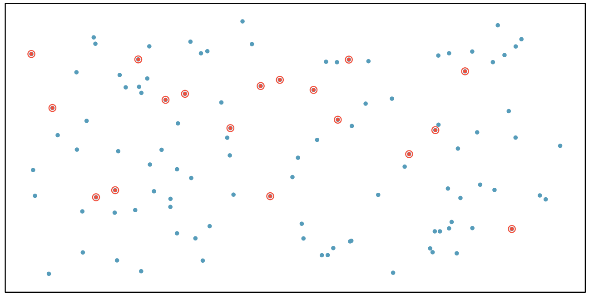

<style>
citation {
  font-size: 4px;
}
</style>

<!--  Version 1.0-0

      This version of the slides is taken from Mine Çetinkaya-Rundel's lecture slides
      posted on OpenIntro.org in .pptx and .gdslides format, and moved to Rmd. Originally done
      as a translation for github.com/wesleyburr/introstat_random/. Some material added throughout,
      and some things cleaned up.
      
      A large part of the HTML/CSS formatting is janky, and could be cleaned up. Feel free to issue a 
      pull request if you love HTML and CSS and want to fix this up.
      
      - wburr, Sept 11, 2018
-->

## Obtaining Good Samples
Almost all statistical methods are based on the notion of implied randomness. 

If observational data are not collected in a random framework from a population, these statistical methods -- the estimates and errors associated with the estimates -- are not reliable.

Most commonly used random sampling techniques are **simple**, **stratified**, and **cluster** sampling.

## Simple Random Sample

Randomly select cases from the population, where there is no implied connection between the points that are selected.

<div style="margin: auto; width: 100%; text-align: center;">
```{r, echo=FALSE, out.width = "700px"} 

```
</div>

## Stratified Sample
Strata are made up of similar observations. We take a simple random sample from each stratum.
 
<div style="margin: auto; width: 100%; text-align: center;">
```{r, echo=FALSE, out.width = "700px"} 
knitr::include_graphics("fig/fig_1_4_stratified.png")
```
</div>

## Cluster Sample
Clusters are usually not made up of homogeneous observations, and we take a simple random sample from a random sample of clusters. Usually preferred for economical reasons.

<div style="margin: auto; width: 100%; text-align: center;">
```{r, echo=FALSE, out.width = "700px"} 
knitr::include_graphics("fig/fig_1_4_cluster.png")
```
</div>

## Practice
A city council has requested a household survey be conducted in a suburban area of their city. The area is broken into many distinct and unique neighborhoods, some including large homes, some with only apartments. Which approach would likely be the *least* effective?

(a) Simple random sampling
(b) Cluster sampling
(c) Stratified sampling
(d) Blocked sampling

## Practice
A city council has requested a household survey be conducted in a suburban area of their city. The area is broken into many distinct and unique neighborhoods, some including large homes, some with only apartments. Which approach would likely be the *least* effective?

(a) Simple random sampling
(b) Cluster sampling
(c) <span id="highlight"> Stratified sampling</span>
(d) Blocked sampling

## Conclusion and Note

The only way to avoid the potential bias of samples is to select the sample **randomly**. Aside from Simple Random Sampling, the other techniques mentioned can be used to assist in this.

**Handout** posted to Blackboard reviewing the topic, and you can read Chapter 1.4.2 in our text.

<!-- Chapter 1.5 -->

<!-- NOTE: the slides posted on OpenIntro appear to be missing a chunk of material at the start. The first
     slide says "More on Blocking", so presumably the set of definitions of principles of experimental design
     was lost, as well as possible discussion of these principles, leaving only the final principle and
     some practice examples. I've re-added some material here. -->

# Experiments

## Principles of Experimental Design
Studies where researchers assign treatments to cases are called **experiments**. If the assignment of treatments to cases (e.g., using a coin flip to determine which treatment a patient receives), the study is called a **randomized experiment**. 

Randomized experiments have a series of four principles.

## Principle 1: Controlling

Researchers assign treatments to cases, and do their best to **control** for other differences between groups. 

**Example**: in a drug trial, patients may be asked to take a pill daily. Some may take the pill dry (ick!), some with just a sip of water, some with coffee, and others with juice. To **control** for the effect of accompanying liquid, a doctor may ask all patients to drink a 12 oz glass of water with the pill.

## Principle 2: Randomization

Researchers **randomize patients** into treatment groups to account for variables that cannot be controlled. 

**Example**: some patients are more susceptible to disease than others due to dietary habits. **Randomizing** patients into treatment/control groups helps even out these differences, possibly preventing accidental bias.

## Principle 3: Replication

The more cases researchers observe, the more accurately they can estimate the effects of explanatory variables on response variables. In a single study, we **replicate** by collecting a sufficiently large sample. Additionally, scientists often replicate an entire study over again to verify earlier findings.

## Principle 4: Blocking

Researchers sometimes know (or suspect) that variables other than the treatment influence the response. Under this situation, they may first group individuals by this variable, and then randomize cases within each block. 
This is known as **blocking**.

**Example**: If we were researching the effect of a drug on heart attacks, we might first split patients into high-risk and low-risk **blocks** (based on diet, physique, genetic screening, or some other approach), and *then* randomly assign half of each block to the control group, and the other half to the drug (treatment) group.

## More on Blocking
<div style="float:left; position:relative; margin-right:50px;"> 
```{r, echo=FALSE, out.width = "200px"}
knitr::include_graphics("fig/fig_1_5_energy_gel.png")
```
</div>
<div style="font-size:24px;">
We would like to design an experiment to investigate if energy gels makes you run faster:

* **Treatment**: energy gel
* **Control**: no energy gel

It is suspected that energy gels might affect pro and amateur athletes differently, therefore we block for pro status:

* Divide the sample to pro and amateur
* Randomly assign pro athletes to treatment and control groups
* Randomly assign amateur athletes to treatment and control groups
* Pro/amateur status is equally represented in the resulting treatment and control groups

**Why is this important? Can you think of other variables to block for?**
</div>

## Practice

A study is designed to test the effect of light level and noise level on exam performance of students. The researcher also believes that light and noise levels might have different effects on males and females, so wants to make sure both genders are equally represented in each group. Which of the below is correct?

1. There are 3 explanatory variables (light, noise, gender) and 1 response variable (exam performance)
2. There are 2 explanatory variables (light and noise), 1 blocking variable (gender), and 1 response variable (exam performance)
3. There is 1 explanatory variable (gender) and 3 response variables (light, noise, exam performance)
4. There are 2 blocking variables (light and noise), 1 explanatory variable (gender), and 1 response variable (exam performance)

## Practice

A study is designed to test the effect of light level and noise level on exam performance of students. The researcher also believes that light and noise levels might have different effects on males and females, so wants to make sure both genders are equally represented in each group. Which of the below is correct?}

1. There are 3 explanatory variables (light, noise, gender) and 1 response variable (exam performance)
2. <span id="highlight">There are 2 explanatory variables (light and noise), 1 blocking variable (gender), and 1 response variable (exam performance)</span>
3. There is 1 explanatory variable (gender) and 3 response variables (light, noise, exam performance)
4. There are 2 blocking variables (light and noise), 1 explanatory variable (gender), and 1 response variable (exam performance)

## Difference between Blocking and Explanatory Variables

Factors are conditions we can impose on the experimental units.

Blocking variables are characteristics that the experimental units come with, that we would like to control for.

Blocking is like stratifying, except used in experimental settings when randomly assigning, as opposed to when sampling.

## More Experimental Design Terminology

**Placebo**: fake treatment, often used as the control group for medical studies

**Placebo effect**: experimental units showing improvement simply because they believe they are receiving a special treatment

**Blinding**: when experimental units do not know whether they are in the control or treatment group

**Double-blind**: when both the experimental units and the researchers who interact with the patients do not know who is in the control and who is in the treatment group

## Practice
What is the main difference between observational studies and experiments?

1. Experiments take place in a lab while observational studies do not need to.
2. In an observational study we only look at what happened in the past.
3. Most experiments use random assignment while observational studies do not.
4. Observational studies are completely useless since no causal inference can be made based on their findings.

## Practice
What is the main difference between observational studies and experiments?

1. Experiments take place in a lab while observational studies do not need to.
2. In an observational study we only look at what happened in the past.
3. <span id="highlight">Most experiments use random assignment while observational studies do not.</span>
4. Observational studies are completely useless since no causal inference can be made based on their findings.

## Random Assignment versus Random Sampling
<div style="float:center; position:relative; left:100px; top:30px;">
```{r, out.width = "800px", echo = FALSE}
knitr::include_graphics("fig/fig_1_5_random.png")
```
</div>

## Next Week

Next week we'll take a look at using R to compute things, talk more about 
experiments (with some science examples), and wrap up the rest of Chapter 1
of our textbook.