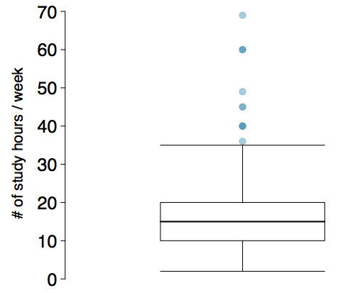

<style>
citation {
  font-size: 4px;
}
</style>

<!--  Version 1.0-0

      This version of the slides is taken directly from Mine Çetinkaya-Rundel's lecture slides
      posted on OpenIntro.org in .pptx and .gdslides format, and moved to Rmd. Originally done
      as a translation for github.com/wesleyburr/introstat_random/.
      
      A large part of the HTML/CSS formatting is janky, and could be cleaned up. Feel free to issue a 
      pull request if you love HTML and CSS and want to fix this up.
      
      - wburr, Sept 10, 2018
-->

# Plotting as Numerical Summary 

## Box Plot
The box in a **box plot** represents the middle 50% of the data, and the thick line in the box is the median.

<center>
```{r, out.width = "400px", echo = FALSE}

```
</center>

## Anatomy of a Box Plot
<center>
```{r, out.width = "600px", echo = FALSE}

```
</center>

## Whiskers and Outliers

The **whiskers** of a box plot can extend up to $1.5 \times \text{IQR}$ away from the quartiles.

*	max upper whisker reach = $\text{Q3} + 1.5 \times \text{IQR}$
*	max lower whisker reach = $\text{Q1} - 1.5 \times \text{IQR}$

**Example**: IQR: 20 - 10 = 10

* max upper whisker reach = $20 + 1.5 \times 10 = 35$
* max lower whisker reach = $10 - 1.5 \times 10 = -5$

A potential outlier is defined as an observation beyond the maximum reach of the whiskers. It is an observation that appears extreme relative to the rest of the data.

## Outliers (continued)

Why is it important to look for outliers?

* Identify extreme skew in the distribution.
* Identify data collection and entry errors.
* Provide insight into interesting features of the data.

## Extreme Observations

How would sample statistics such as mean, median, SD, and IQR of household income be affected if the largest value was replaced with \$10 million? What if the smallest value was replaced with \$10 million?

<center>
```{r, out.width = "700px", echo = FALSE}
knitr::include_graphics("fig/fig_1_6_extreme1.png")
```
</center>

## Robust Statistics

<center>
```{r, out.width = "700px", echo = FALSE}
knitr::include_graphics("fig/fig_1_6_extreme2.png")
```
</center>

## Robust Statistics

Median and IQR are more robust to skewness and outliers than mean and SD. Therefore,

* for skewed distributions it is often more helpful to use median and IQR to describe the center and spread
* for symmetric distributions it is often more helpful to use the mean and SD to describe the center and spread

If you would like to estimate the typical household income for a student, would you be more interested in the mean or median income?

## Robust Statistics

Median and IQR are more robust to skewness and outliers than mean and SD. Therefore,

* for skewed distributions it is often more helpful to use median and IQR to describe the center and spread
* for symmetric distributions it is often more helpful to use the mean and SD to describe the center and spread

If you would like to estimate the typical household income for a student, would you be more interested in the mean or median income?

<span id="highlight">Median</span>

## Mean versus Median

If the distribution is symmetric, center is often defined as the mean:

* mean $\approx$ median

<div style="float:right; position:relative; right:100px; left:20px;">
```{r, out.width = "200px", echo = FALSE}

```
</div>

If the distribution is skewed or has extreme outliers, center is often defined as the median

* Right-skewed: mean > median
* Left-skewed: mean < median

<center>
```{r, out.width = "450px", echo = FALSE}

```
</center>

## Practice
Which is most likely true for the distribution of percentage of time actually spent taking notes in class versus on Facebook, Twitter, etc.?

<center>
```{r, out.width = "450px", echo = FALSE}
knitr::include_graphics("fig/fig_1_6_practice1.png")
```
</center>

1. mean > median  &nbsp;&nbsp;   3. mean $\approx$ median
2. mean < median  &nbsp;&nbsp;   4. impossible to tell

<!-- div hacking is really frustrating, to get things to float properly -->
## Practice
Which is most likely true for the distribution of percentage of time actually spent taking notes in class versus on Facebook, Twitter, etc.?

If we compute, the mean = 80% and the median = 76%. So ...
<div style="position:relative; float:right;">
```{r, out.width = "450px", echo = FALSE}
knitr::include_graphics("fig/fig_1_6_practice1.png")
```
</div>

<p>
1. mean > median  &nbsp;&nbsp;  3. mean $\approx$ median
2. <span id="highlight">mean < median</span> &nbsp;&nbsp;   4. impossible to tell

## Extremely Skewed Data

When data are extremely skewed, transforming them might make modeling easier. A common transformation is the **log transformation**.

The histograms on the left shows the distribution of number of basketball games attended by students. The histogram on the right shows the distribution of log of number of games attended.

<center>
```{r, out.width = "800px", echo = FALSE}
knitr::include_graphics("fig/fig_1_6_practice2.png")
```
</center>

## Pros and Cons of Transformations

Skewed data are easier to model with when they are transformed because outliers tend to become far less prominent after an appropriate transformation.
 
\# of games	70	  50    25    $\cdots$
----------- ----  ----  ----  -------- 
\# of games	4.25  3.91  3.22  $\cdots$
 
However, results of an analysis might be difficult to interpret because the log of a measured variable is usually meaningless.

What other variables would you expect to be extremely skewed?

## Pros and Cons of Transformations

Skewed data are easier to model with when they are transformed because outliers tend to become far less prominent after an appropriate transformation.
 
\# of games	70	  50    25    $\cdots$
----------- ----  ----  ----  -------- 
\# of games	4.25  3.91  3.22  $\cdots$
 
However, results of an analysis might be difficult to interpret because the log of a measured variable is usually meaningless.

What other variables would you expect to be extremely skewed?

<span id="highlight">Salary, housing prices, ability to throw a football, ...</span>

## If Time Allows ...

Back to RStudio!