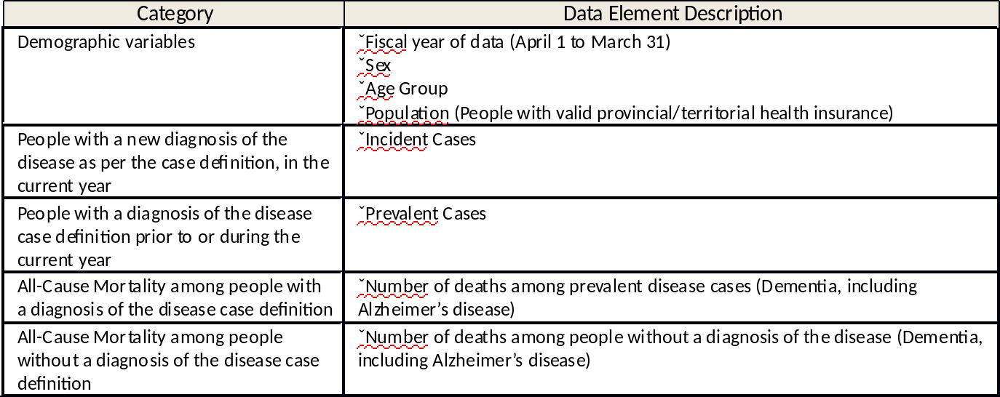

```{r setup, include=FALSE}
knitr::opts_chunk$set(echo = TRUE)
```

## The Example of the Day: Disease in Canada

```{r load-pkg, message = FALSE}
library(tidyverse)
```

Our data for the data is the **Canadian Chronic Disease Surveillance**
data set, an **OpenData** set available from [http://open.canada.ca](https://open.canada.ca/data/en/dataset/9525c8c0-554a-461b-a763-f1657acb9c9d). We'll start by loading the data.

```{r loadData, cache = TRUE, message = FALSE}
url <- "https://infobase.phac-aspc.gc.ca/ccdss-scsmc/data-tool/publication/ccdss-scsmc-eng.csv"
dat <- read_csv(url)
```

## Exploring the Data

As always, the first thing we should do when looking at a new data set is open it up and look at it. The questions we can ask are endless, but here's a sample:

* What variables are present? 
* What variable **type** are the variables present? 
* Which variables are interesting to us? Why?
* How might we visualize this data?


```{r dataExplore, cache = TRUE}
head(dat)
dim(dat)
```

We have 5276 observations of 9 variables: **Disease**, **Fiscal Year**, **Gender**, **Age Group**, **Population**, **Incidence**, **Prevalence**, **Mortality with Disease** and **Mortality without Disease**. What do these variables **mean**?

### Meta-Data

Remember we discussed **meta**-data in earlier lectures. This is data **about** data. Most public data sets come with a "guide", telling you what the variables are, how they were gathered, and what they might mean. This data set is no different. At the same website the data was available from is a Word document which explains the contents of the data set. I've grabbed the key table from this file, and included it below.

```{r, echo=FALSE, out.width = "450px"}

```

This gives some interesting, counter-intuitive results. For example, the **Fiscal Year** variable refers to a year which runs from April 1 to March 31. That's the Canadian federal government fiscal year, **not** the calendar year. The **Population** variable gives the number of people with valid
health insurance: that's the full number of people who might be afflicted by a given disease for a given region. **Incidence** and **Prevalence** are new cases and old cases, respectively, and the **Mortality** counts are all-cause mortality. This last, "All-Cause", means non-accidental deaths, and the **WithDisease** version is those who died, with a diagnosis of the disease as a cause.
### Cleanup

In R, it's much easier to work with things if the columns are named just one word. So let's rename the columns of this dataset to make our lives below a little easier.

```{r rename}
names(dat) <- c("Disease", "Year", "Gender", "Age", "Population",
                "Incidence", "Prevalence", "MortWithDisease", "MortWithoutDisease")
```

There's one more problem with dat: the variables **Incidence**, **MortWithDisease** and **MortWithoutDisease** are
all characters! Why?! This happens when you import and export data: sometimes the auto-detection forces things to
become characters. And characters are **not** numbers, and we need numbers to plot. Let's fix this.

```{r fix_chars}
dat_fix <- dat
dat_fix$Incidence <- as.numeric(dat$Incidence)
dat_fix$MortWithDisease <- as.numeric(dat$MortWithDisease)
dat_fix$MortWithoutDisease <- as.numeric(dat$MortWithoutDisease)
```

There **is** an error (or warning) message here: "NAs introduced by coercion". This is scary looking! It says that some of the values in this **vector** didn't make sense, so it set those values to **NA**. This means "not available" - R doesn't know what it is, so classified that value as **missing**. Why might there be a missing value? Here's an example row that had a missing value in the original data.

```{r example_bad}
dat[1000, ]
dat_fix[1000, ]
```

What's happening here? Observation 1000 is Disease "Mental_Illness", for 2013, for men between 45 and 49. And the **Incidence** value is NA, Not Available. Why might this be? Does this actually make physical sense for interpreting our data?

## Visualizations

Let's visualize some data! How many unique diseases are in our data set?

```{r subsetting, cache = TRUE}
unique(dat$Disease)
```

There are 15 unique diseases in our data set, and each one is broken down into years, gender, and age groups in approximately 5-year blocks. I'm going to start by visualizing Asthma, for the year 2000, for females only.

```{r asthma_vis, cache = TRUE}
asthma <- dat_fix %>%
            filter(Year == 2000, Disease == "Asthma", Gender == "F") %>%
            select(Age, Population, Prevalence)
g <- ggplot(asthma, aes(x = Age, y = Population)) + 
       geom_col() +
       theme(axis.text.x = element_text(angle = 90, hjust = 1))
g
```

This first plot is a bar plot, showing the number of females in Canada in the year 2000, divided by age group. Not terribly interesting, but it does present us an opportunity: is this data skewed? What issues might be causing this data to look a little odd?

Let's look at the prevalence of asthma, not just the population:

```{r asthma_vis2, cache = TRUE}
g <- ggplot(asthma, aes(x = Age, y = Prevalence)) + 
       geom_col() +
       theme(axis.text.x = element_text(angle = 90, hjust = 1))
g
```

Well, that's odd. Why is there a big spike in the middle of the graph? Wait a minute ... what age is that?

Turns out that R sorts the bars **alphabetically**, so "5 to 9" got moved to after "45 to 49" and before "50 to 54". That's not quite what we had in mind, was it?!

```{r asthma_vis3}
asthma$AgeSort <- factor(asthma$Age, levels = asthma$Age)
g <- ggplot(asthma, aes(x = AgeSort, y = Prevalence)) + 
       geom_col() +
       theme(axis.text.x = element_text(angle = 90, hjust = 1))
g
```

There we go, that's better. We forced R to use the **AgeSort** variable there, which forced the ages to go in the order we had them in the data set, **not** the alphabetical sorting which messed things up in the previous plot.

Now interpret away! What do we see about this plot? What can we say about asthma?

### Comparing Genders

Our previous plot explored females in Canada for one year. Let's look at males **and** females in Canada for one year, and determine the percentage of each gender who were "Incident" (that is, diagnosed newly in the year 2000).
We'll have to filter the data set again. Let's do it for Diabetes.

```{r diabetes_analysis}
diabetes <- dat_fix %>%
              filter(Year == 2000, Disease == "Diabetes") %>%
              group_by(Gender) %>%
              summarise(TotalNew = sum(Incidence), TotalPop = sum(Population))
g <- ggplot(diabetes, aes(x = Gender, y = TotalNew / TotalPop)) + geom_col()
g
```

So we see from this plot that the percentage of Males newly diagnosed with Diabetes in the year 2000 was higher than that of Females. Since these are percentages, we're comparing somewhat fairly. 

### What about Over Time?

Now instead of looking just at the year 2000, let's look at the changes over time. We'll have to add up all the different age categories this time, and merge the two genders.

```{r diabetes_analysis_time1}
diabetes <- dat_fix %>%
              filter(Disease == "Diabetes") %>%
              group_by(Year) %>%
              summarise(TotalNew = sum(Incidence), TotalPop = sum(Population))
g <- ggplot(diabetes, aes(x = Year, y = TotalNew / TotalPop)) + geom_col()
g
```

So over time, from 2000 to 2013, the number of new cases of Diabetes among females in Canada stayed fairly flat, with a possibly slow rise from 2000 to 2006 or 20007, and similar "possible" very slow decrease from 2009 to 2013. We can do this for just males:

```{r diabetes_analysis_time2}
diabetes <- dat_fix %>%
              filter(Disease == "Diabetes", Gender == "M") %>%
              group_by(Year) %>%
              summarise(TotalNew = sum(Incidence), TotalPop = sum(Population))
g <- ggplot(diabetes, aes(x = Year, y = TotalNew / TotalPop)) + geom_col()
g
```


and females:

```{r diabetes_analysis_time3}
diabetes <- dat_fix %>%
              filter(Disease == "Diabetes", Gender == "F") %>%
              group_by(Year) %>%
              summarise(TotalNew = sum(Incidence), TotalPop = sum(Population))
g <- ggplot(diabetes, aes(x = Year, y = TotalNew / TotalPop)) + geom_col()
g
```

And unfortunately, we're about out of time. Hopefully you enjoyed seeing the visualization material from Wednesday's class applied to some **real** data.

### Challenge

Take the above analysis, copy the required bits of code (start from where we started doing **Visualizations**, leave everything before that) and do a similar exploration of the data for Mental_Illness. Try years other than 2000. What happens to **Prevalence** of Mental_Illness over time?

**Make sure** you change the Chunk Labels when you copy things, or they'll break with a "duplicate label" error in R Markdown.