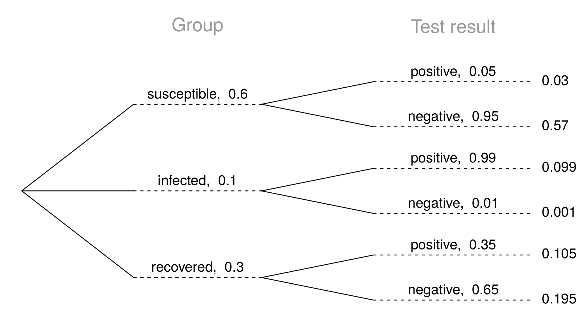

<style>
citation {
  font-size: 4px;
}
</style>

## $\;$

**Checking for independence**: 

If P(A occurs, given that B is true) = $P(A~|~B) = P(A)$, then A and B are independent.

## The Gun Ownership Question

* P(protects citizens) = 0.58 
* P(randomly selected NC resident says gun ownership protects citizens, given that the resident is white) =  P(protects citizens $|$ White) = 0.67 
* P(protects citizens $|$ Black) = 0.28 
* P(protects citizens $|$ Hispanic) = 0.64 

P(protects citizens) varies by race/ethnicity, therefore opinion on gun ownership and race ethnicity are most likely dependent.

## Determining dependence based on sample data

* If conditional probabilities calculated based on sample data suggest dependence between two variables, the next step is to conduct a hypothesis test to determine if the observed difference between the probabilities is likely or unlikely to have happened by chance.
* If the observed difference between the conditional probabilities is large, then there is stronger evidence that the difference is real.
* If a sample is large, then even a small difference can provide strong evidence of a real difference.

## More on dependence

We saw that P(protects citizens $|$ White) = 0.67 and P(protects citizens $|$ Hispanic) = 0.64. Under which condition would you be more convinced of a real difference between the proportions of Whites and Hispanics who think gun widespread gun ownership protects citizens? $n = 500$ or $n = 50,000$

## $\;$

**Product rule for independent events**: $P(A~and~B) = P(A) \times P(B)$

<br>
More generally, $P(A_1~and~\cdots~and~A_k) = P(A_1) \times \cdots \times P(A_k)$

## Example

You toss a coin twice, what is the probability of getting two tails in a row?

<br>
$P(\text{T on the first toss}) \times  P(\text{T on the second toss}) = \frac{1}{2} \times \frac{1}{2} = \frac{1}{4}$

## Practice

A recent Gallup poll suggests that 25.5% of Texans do not have health insurance as of June 2012. Assuming that the uninsured rate stayed constant, what is the probability that two randomly selected Texans are both uninsured?

<div style= "float:right;position: relative; left: 10px; top: -20px;">
<center>
```{r, out.width = "500px", echo = FALSE}

```
</center>
</div>
<div>
* $25.5^2$
* $0.255^2$ 
* $0.255 \times 2$
* $(1 - 0.255)^2$
</div>


<span id="footnote">http://www.gallup.com/poll/156851/uninsured-rate-stable-across-states-far-2012.aspx</span>

## Disjoint vs. complementary

**Do the sum** of probabilities of two disjoint events always add up to 1?

## Disjoint vs. complementary

**Do the sum** of probabilities of two disjoint events always add up to 1?

Not necessarily, there may be more than 2 events in the sample space, e.g. party affiliation.

## Disjoint vs. complementary

**Do the sum** of probabilities of two disjoint events always add up to 1?

Not necessarily, there may be more than 2 events in the sample space, e.g. party affiliation.

<br>

**Do the sum** of probabilities of two complementary events always add up to 1?

## Disjoint vs. complementary

**Do the sum** of probabilities of two disjoint events always add up to 1?

Not necessarily, there may be more than 2 events in the sample space, e.g. party affiliation.

<br>

**Do the sum** of probabilities of two complementary events always add up to 1?

Yes, that's the definition of complementary, e.g. heads and tails. 

## Putting everything together...

**If** we were to randomly select 5 Texans, what is the probability that at least one is uninsured?

* If we were to randomly select 5 Texans, the sample space for the number of Texans who are uninsured would be:
$S = \{0, 1, 2, 3, 4, 5\}$
* We are interested in instances where at least one person is uninsured:
$S = \{0,$ **1, 2, 3, 4, 5**$\}$
* So we can divide up the sample space into two categories:
$S = \{0,$ **at least one**$\}$

## Putting everything together...

Since the probability of the sample space must add up to 1, and
$P(\text{at least one}) = 1 - P(\text{none})$

$$
\begin{split}
\text{Prob}(\text{at least 1 uninsured}) &= 1 - \text{Prob}(\text{none uninsured}) \\
&= 1 - [(1-0.255)^5] \\
&= 1- 0.745^5 \\
&= 1 - 0.23 \\
&= 0.77
\end{split}
$$


## Practice

Roughly 20% of undergraduates at a university are vegetarian or vegan. What is the probability that, among a random sample of 3 undergraduates, at least one is vegetarian or vegan?

* $1 - 0.2 \times 3$
* $1 - 0.2^3$
* $0.8^3$
* $1 - 0.8 \times 3$
* $1 - 0.8^3$


## Practice

$$
\begin{split}
P(\text{at least 1 from veg}) &= 1- P(\text{none veg})\\
&= 1 - (1 - 0.2)^3\\
&= 1 - 0.8^3\\
&= 1 - 0.512 = 0.488\\
\end{split}
$$

## Practice

Roughly 20% of undergraduates at a university are vegetarian or vegan. What is the probability that, among a random sample of 3 undergraduates, at least one is vegetarian or vegan?

* $1 - 0.2 \times 3$
* $1 - 0.2^3$
* $0.8^3$
* $1 - 0.8 \times 3$
* <span id="highlight">$1 - 0.8^3$</span>

<!-- Chapter 2.2 -->

# Conditional probability

## Relapse

Researchers randomly assigned 72 chronic users of cocaine into three groups: desipramine (antidepressant), lithium (standard treatment for cocaine) and placebo. Results of the study are summarized below.

$\;$             relapse  	no relapse   total 
--------------   --------   -----------  ------
desipramine	      10		     14           24 
lithium           18          6           24 
placebo           20          4		        24 
total             48         24           72

<span id="footnote">http://www.oswego.edu/~srp/stats/2_way_tbl_1.htm</span>

## Marginal probability

**What is the probability that a patient relapsed?**

$\;$             relapse  	no relapse   total 
--------------   --------   -----------  ------
desipramine	      10		     14           24 
lithium           18          6           24 
placebo           20          4		        24 
total             48         24           72

## Marginal probability

**What is the probability that a patient relapsed?**

$\;$             relapse  	no relapse   total 
--------------   --------   -----------  ------
desipramine	      10		     14           24 
lithium           18          6           24 
placebo           20          4		        24 
total             **48**     24          **72**

<br>
$P(\text{relapsed}) = \frac{48}{72} \approx 0.67$

## Joint probability

**What is the probability that a patient received the antidepressant (desipramine) and relapsed?**


$\;$             relapse  	no relapse   total 
--------------   --------   -----------  ------
desipramine	      **10**		 14           24 
lithium           18          6           24 
placebo           20          4		        24 
total             48         24          **72**

<br>
$P(\text{relapsed and desipramine}) = \frac{10}{72} \approx 0.14$

## Conditional probability

**The conditional probability of the outcome of interest $A$ given condition $B$ is calculated as**

$P(A|B) = \frac{P(A\text{ and }B)}{P(B)}$

$\;$             relapse  	no relapse   total 
--------------   --------   -----------  ------
desipramine	      10    		 14           24 
lithium           18          6           24 
placebo           20          4		        24 
total             48         24           72

## Conditional probability

**The conditional probability of the outcome of interest $A$ given condition $B$ is calculated as**

$$
\begin{split}
P(\text{relapse} | \text{desipramine}) &= \frac{P(\text{relapse and desipramine})}{P(\text{desipramine})} \\
&= \frac{10 / 72}{24 / 72} \\
&= \frac{10}{24} = 0.42
\end{split}
$$


## Conditional probability (cont.)

**If we know that a patient received the antidepressant (desipramine), what is the probability that they relapsed?**

$\;$             relapse  	no relapse   total 
--------------   --------   -----------  -------
desipramine	      **10**     14           **24**
lithium           18          6           24 
placebo           20          4		        24 
total             48         24           72

$$
\begin{split}
P(\text{relapse} | \text{desipramine}) &= \frac{10}{24} \approx 0.42
\end{split}
$$


## Conditional probability (cont.)

$$
\begin{split}
P(\text{relapse} | \text{desipramine}) &= \frac{10}{24} \approx 0.42\\
P(\text{relapse} | \text{lithium}) &= \frac{18}{24} \approx 0.75 \\
P(\text{relapse} | \text{placebo}) &= \frac{20}{24} \approx 0.83 \\
\end{split}
$$


## Conditional probability (cont.)

**If we know that a patient relapsed, what is the probability that they received the antidepressant (desipramine)?**

$\;$             relapse  	no relapse   total 
--------------   --------   -----------  -------
desipramine	      **10**     14           24
lithium           18          6           24 
placebo           20          4		        24 
total             **48**     24           72

$$
\begin{split}
P(\text{desipramine}|\text{relapse}) &= \frac{10}{48} \approx 0.21
\end{split}
$$


## General multiplication rule

* Earlier we saw that if two events are independent, their joint probability is simply the product of their probabilities. If the events are not believed to be independent, the joint probability is calculated slightly differently.
* If $A$ and $B$ represent two outcomes or events, then $P(\text{A and B}) = P(A|B) \times P(B)$
Note that this formula is simply the conditional probability formula, rearranged.
* It is useful to think of $A$ as the outcome of interest and $B$ as the condition.


## Independence and conditional probabilities

Consider the following (hypothetical) distribution of gender and major of students in an introductory statistics class:

         social science   non-social science   total 
-------  ---------------  -------------------  ------
female    30               20                    50 
male      30               20                    50 
total     60               40                   100


* <span style="font-size:18px;">The probability that a randomly selected student is a social science major is \pause $\frac{60}{100} = 0.6$. </span>
* <span style="font-size:18px;">The probability that a randomly selected student is a social science major given that they are female is \pause $\frac{30}{50} = 0.6$. </span>
* <span style="font-size:18px;">Since $P(SS | M)$ also equals 0.6, major of students in this class does not depend on their gender: P(SS $|$ F) = P(SS).</span>

## Independence and conditional probabilities (cont.)

Generically, if $P(A|B) = P(A)$ then the events $A$ and $B$ are said to be independent.

* Conceptually: Giving $B$ doesn't tell us anything about $A$.
* Mathematically: We know that if events $A$ and $B$ are independent, $P(A~and~B) = P(A) \times P(B)$. Then, 

$$
P(A|B) = \frac{P(\text{A\text{ and }B})}{P(B)} = \frac{P(A) \times P(B)}{P(B)} = P(A)
$$

## Breast cancer screening

* American Cancer Society estimates that about 1.7% of women have breast cancer. 
* Susan G. Komen For The Cure Foundation states that mammography correctly identifies about 78% of women who truly have breast cancer. 
* An article published in 2003 suggests that up to 10% of all mammograms result in false positives for patients who do not have cancer. 

<br>
**These percentages are approximate, and very difficult to estimate.**

<div id="footnote">http://www.cancer.org/cancer/cancerbasics/cancer-prevalence <br>
http://ww5.komen.org/BreastCancer/AccuracyofMammograms.html <br>
http://www.ncbi.nlm.nih.gov/pmc/articles/PMC1360940</div>

## Inverting probabilities

When a patient goes through breast cancer screening there are two competing claims: patient had cancer and patient doesn't have cancer. If a mammogram yields a positive result, what is the probability that patient actually has cancer?

<center>
```{r, out.width = "600px", echo = FALSE}
knitr::include_graphics("fig/cancer_tree_first.png")
```
</center>

## Inverting probabilities (ctd.)

$$
\begin{split}
P(C | +) &= \frac{P(\text{C and +})}{P(+)} \\
&= \frac{0.0133}{0.0133 + 0.0983} \\
&= 0.12
\end{split}
$$

**Note**: Tree diagrams are useful for inverting probabilities: we are given $P(+|C)$ and asked for $P(C|+)$.


## Practice

Suppose a woman who gets tested once and obtains a positive result wants to get tested again. In the second test, what should we assume to be the probability of this specific woman having cancer?

* 0.017
* 0.12
* 0.0133
* 0.88

## Practice

Suppose a woman who gets tested once and obtains a positive result wants to get tested again. In the second test, what should we assume to be the probability of this specific woman having cancer?

* 0.017
* <span id="highlight">0.12</span>
* 0.0133
* 0.88

## Practice

What is the probability that this woman has cancer if this second mammogram also yielded a positive result?

<center>
```{r, out.width = "600px", echo = FALSE}
knitr::include_graphics("fig/cancer_tree_first.png")
```
</center>

## Practice

What is the probability that this woman has cancer if this second mammogram also yielded a positive result?

* 0.0936
* 0.088
* 0.48
* 0.52

## Practice

What is the probability that this woman has cancer if this second mammogram also yielded a positive result?

* 0.0936
* 0.088
* 0.48
* <span id="highlight">0.52</span>

$P(C | +) = \frac{P(\text{C and +})}{P(+)} = \frac{0.0936}{0.0936+0.088} = 0.52$


## Bayes' Theorem

* The conditional probability formula we have seen so far is a special case of the Bayes' Theorem, which is applicable even when events have more than just two outcomes.
* **Bayes' Theorem:**
$$
\begin{split}
P(\text{outcome }&A_1\text{ of variable 1}|\text{outcome B of variable 2}) \\
 &=\frac{P(B|A_1)P(A_1)}{P(B|A_1)P(A_1) + P(B|A_2)P(A_2) + \cdots + P(B|A_k)P(A_k)}
\end{split}
$$
where $A_2$, $\cdots$, $A_k$ represent all other possible outcomes of variable 1.

## Application activity: Inverting probabilities

<span style="font-size:20px;">A common epidemiological model for the spread of diseases is the SIR model, where the population is partitioned into three groups: Susceptible, Infected, and Recovered. This is a reasonable model for diseases like chickenpox where a single infection usually provides immunity to subsequent infections. Sometimes these diseases can also be difficult to detect. </span>

<span style="font-size:20px;">Imagine a population in the midst of an epidemic where 60% of the population is considered susceptible, 10% is infected, and 30% is recovered. The only test for the disease is accurate 95% of the time for susceptible individuals, 99% for infected individuals, but 65% for recovered individuals. (Note: In this case accurate means returning a negative result for susceptible and recovered individuals and a positive result for infected individuals).</span>

<span style="font-size:20px;">Draw a probability tree to reflect the information given above. If the individual has tested positive, what is the probability that they are actually infected?</span>


## Application activity: Inverting probabilities (cont.)

<center>
```{r, out.width = "700px", echo = FALSE}

```
</center>

$$
P(\text{inf } |\, +) = \frac{P(\text{inf and } +)}{P(+)} = \frac{0.099}{0.03 + 0.099 + 0.105} \approx 0.423
$$

<!-- page 106 of original LaTeX slides: this covers 2-1 and 2-2. Need to still transcribe 2-3+. -->