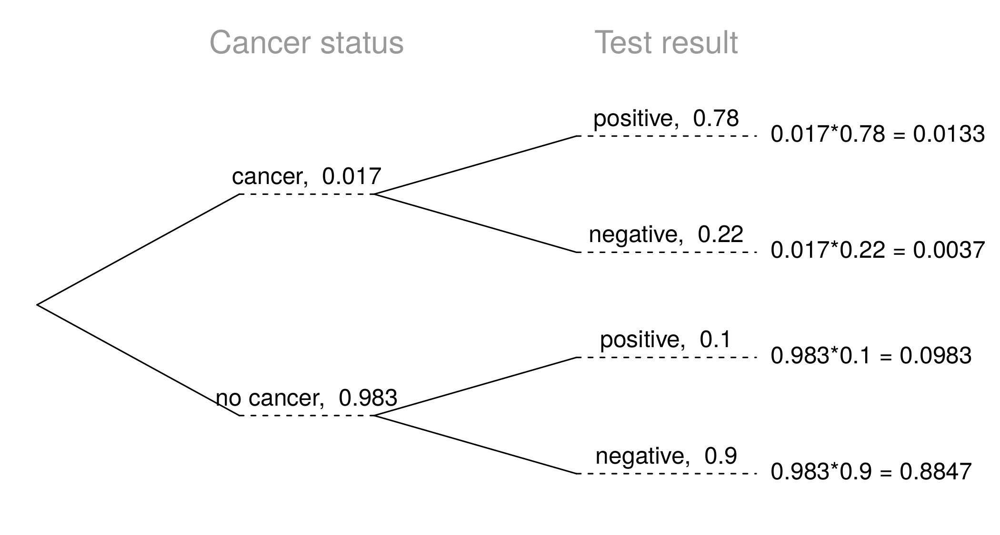

<style>
citation {
  font-size: 4px;
}
</style>

## General multiplication rule

* Earlier we saw that if two events are independent, their joint probability is simply the product of their probabilities. If the events are not believed to be independent, the joint probability is calculated slightly differently.
* If $A$ and $B$ represent two outcomes or events, then $P(\text{A and B}) = P(A|B) \times P(B)$
* Note that this formula is simply the conditional probability formula, rearranged.
* It is useful to think of $A$ as the outcome of interest and $B$ as the condition.


## Independence and conditional probabilities

Consider the following (hypothetical) distribution of gender and major of students in an introductory statistics class:

         social science   non-social science   total 
-------  ---------------  -------------------  ------
female    30               20                    50 
male      30               20                    50 
total     60               40                   100


* <span style="font-size:18px;">The probability that a randomly selected student is a social science major is \pause $\frac{60}{100} = 0.6$. </span>
* <span style="font-size:18px;">The probability that a randomly selected student is a social science major given that they are female is \pause $\frac{30}{50} = 0.6$. </span>
* <span style="font-size:18px;">Since $P(SS | M)$ also equals 0.6, major of students in this class does not depend on their gender: P(SS $|$ F) = P(SS).</span>

## Independence and conditional probabilities (cont.)

Generically, if $P(A|B) = P(A)$ then the events $A$ and $B$ are said to be independent.

* Conceptually: Giving $B$ doesn't tell us anything about $A$.
* Mathematically: We know that if events $A$ and $B$ are independent, $P(\text{A and B}) = P(A) \times P(B)$. Then, 

$$
P(A|B) = \frac{P(\text{A and B})}{P(B)} = \frac{P(A) \times P(B)}{P(B)} = P(A)
$$

## Breast cancer screening

* American Cancer Society estimates that about 1.7% of women have breast cancer. 
* Susan G. Komen For The Cure Foundation states that mammography correctly identifies about 78% of women who truly have breast cancer. 
* An article published in 2003 suggests that up to 10% of all mammograms result in false positives for patients who do not have cancer. 

<br>
**These percentages are approximate, and very difficult to estimate.**

* http://www.cancer.org/cancer/cancerbasics/cancer-prevalence 
* http://ww5.komen.org/BreastCancer/AccuracyofMammograms.html 
* http://www.ncbi.nlm.nih.gov/pmc/articles/PMC1360940

## Inverting probabilities

When a patient goes through breast cancer screening there are two competing claims: patient had cancer and patient doesn't have cancer. If a mammogram yields a positive result, what is the probability that patient actually has cancer?

<center>
```{r, out.width = "600px", echo = FALSE}

```
</center>

## Inverting probabilities (ctd.)

$$
\begin{split}
P(C | +) &= \frac{P(\text{C and +})}{P(+)} \\
&= \frac{0.0133}{0.0133 + 0.0983} \\
&= 0.12
\end{split}
$$

**Note**: Tree diagrams are useful for inverting probabilities: we are given $P(+|C)$ and asked for $P(C|+)$.


## Practice

Suppose a woman who gets tested once and obtains a positive result wants to get tested again. In the second test, what should we assume to be the probability of this specific woman having cancer?

* 0.017
* 0.12
* 0.0133
* 0.88

## Practice

Suppose a woman who gets tested once and obtains a positive result wants to get tested again. In the second test, what should we assume to be the probability of this specific woman having cancer?

* 0.017
* <span id="highlight">0.12</span>
* 0.0133
* 0.88

## Practice

What is the probability that this woman has cancer if this second mammogram also yielded a positive result?

<center>
```{r, out.width = "600px", echo = FALSE}

```
</center>

## Practice

What is the probability that this woman has cancer if this second mammogram also yielded a positive result?

* 0.0936
* 0.088
* 0.48
* 0.52

## Practice

What is the probability that this woman has cancer if this second mammogram also yielded a positive result?

* 0.0936
* 0.088
* 0.48
* <span id="highlight">0.52</span>

$P(C | +) = \frac{P(\text{C and +})}{P(+)} = \frac{0.0936}{0.0936+0.088} = 0.52$


## Bayes' Theorem

* The conditional probability formula we have seen so far is a special case of the Bayes' Theorem, which is applicable even when events have more than just two outcomes.
* **Bayes' Theorem:**
$$
\begin{split}
P(\text{outcome }&A_1\text{ of variable 1}|\text{outcome B of variable 2}) \\
 &=\frac{P(B|A_1)P(A_1)}{P(B|A_1)P(A_1) + P(B|A_2)P(A_2) + \cdots + P(B|A_k)P(A_k)}
\end{split}
$$
where $A_2$, $\cdots$, $A_k$ represent all other possible outcomes of variable 1.

## Application activity: Inverting probabilities

<span style="font-size:20px;">A common epidemiological model for the spread of diseases is the SIR model, where the population is partitioned into three groups: Susceptible, Infected, and Recovered. This is a reasonable model for diseases like chickenpox where a single infection usually provides immunity to subsequent infections. Sometimes these diseases can also be difficult to detect. </span>

<span style="font-size:20px;">Imagine a population in the midst of an epidemic where 60% of the population is considered susceptible, 10% is infected, and 30% is recovered. The only test for the disease is accurate 95% of the time for susceptible individuals, 99% for infected individuals, but 65% for recovered individuals. (Note: In this case accurate means returning a negative result for susceptible and recovered individuals and a positive result for infected individuals).</span>

<span style="font-size:20px;">Draw a probability tree to reflect the information given above. If the individual has tested positive, what is the probability that they are actually infected?</span>

## $\;$

<br>

## Application activity: Inverting probabilities (cont.)

<center>
```{r, out.width = "700px", echo = FALSE}
knitr::include_graphics("fig/sir_tree.png")
```
</center>

$$
P(\text{inf } |\, +) = \frac{P(\text{inf and } +)}{P(+)} = \frac{0.099}{0.03 + 0.099 + 0.105} \approx 0.423
$$

## $\;$

And now, we're going to solve some problems in real-time, using the WeBWorK Practice
for problems, and RStudio as a giant calculator!