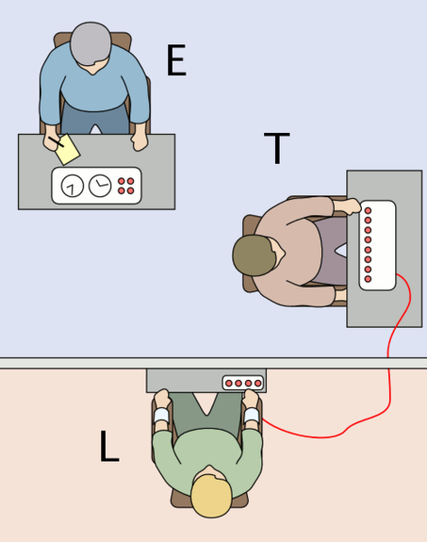
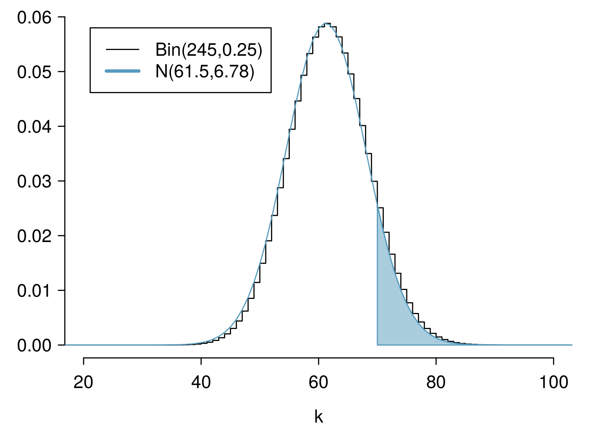

<style>
citation {
  <!-- font-size: 4px; -->
}
</style>

# Geometric distribution

## Milgram experiment

<div style= "float:left; position: relative; top: 0px; left:-25px; right:25px;">
```{r, out.width = "300px", echo = FALSE}

```
</div>
<div style = "position:relative; left: 25px;">
* Stanley Milgram, a Yale University psychologist, conducted a series of experiments on obedience to authority starting in 1963. 
* Experimenter (E) orders the teacher (T), the subject of the experiment, to give severe electric shocks to a learner (L) each time the learner answers a question incorrectly. 
* The learner is actually an actor, and the electric shocks are not real, but a prerecorded sound is played each time the teacher administers an electric shock.
</div>

## Milgram experiment (cont.)

* These experiments measured the willingness of study participants to obey an authority figure who instructed them to perform acts that conflicted with their personal conscience.
* Milgram found that about 65\% of people would obey authority and give such shocks.
* Over the years, additional research suggested this number is approximately consistent across communities and time.

## Bernouilli random variables

* Each person in Milgram's experiment can be thought of as a **trial**.
* A person is labeled a **success** if she refuses to administer a severe shock, and **failure** if she administers such shock.
* Since only 35% of people refused to administer a shock, **probability of success** is $p = 0.35$.
* When an individual trial has only two possible outcomes, it is called a **Bernoulli random variable**.

## Geometric distribution

Dr. Smith wants to repeat Milgram's experiments but she only wants to sample people until she finds someone who will not inflict a severe shock. What is the probability that she stops after the first person?

$$
P(1^{st}\text{ person refuses}) = 0.35
$$

## Geometric distribution

... the third person?
$$
P(1^{st}\text{ and }2^{nd}\text{ shock, }3^{rd}\text{ refuses}) = S ( 0.65) \times S (0.65) \times  R (0.35) \\= 0.65^2 \times 0.35 \approx 0.15 
$$

## Geometric distribution

... the tenth person?
$$
P(\text{9 shock, } 10^{th}\text{ refuses}) = \underbrace{S (0.65) \times \cdots \times S (0.65)}_{9\text{ of these}} \times  R (0.35) \\= 0.65^9 \times 0.35 \approx 0.0072
$$

## Geometric distribution (cont.)

The **Geometric distribution** describes the waiting time until a success for **independent and identically distributed (iid)** Bernouilli random variables.

* independence: outcomes of trials don't affect each other
* identical: the probability of success is the same for each trial

## Geometric distribution (cont.)

**Geometric probabilities**:  If $p$ represents probability of success, $(1-p)$ represents probability of failure, and $n$ represents number of independent trials $P(\text{success on the }n^{th}\text{ trial}) = (1-p)^{n-1} p$.

Can we calculate the probability of rolling a 6 for the first time on the 6$^{th}$ roll of a die using the geometric distribution? Note that what was a success (rolling a 6) and what was a failure (not rolling a 6) are clearly defined and one or the other must happen for each trial.}

* no, on the roll of a die there are more than 2 possible outcomes
* yes, why not

## Geometric distribution (cont.)

Can we calculate the probability of rolling a 6 for the first time on the 6$^{th}$ roll of a die using the geometric distribution? Note that what was a success (rolling a 6) and what was a failure (not rolling a 6) are clearly defined and one or the other must happen for each trial.}

* no, on the roll of a die there are more than 2 possible outcomes
* <span id="highlight">yes, why not</span>

$$
P(6\text{ on the }6^{th}\text{ roll}) = \left(\frac{5}{6}\right)^5 \left( \frac{1}{6}\right) \approx 0.067
$$

## Expected value

How many people is Dr. Smith expected to test before finding the first one that refuses to administer the shock?

## Expected value

How many people is Dr. Smith expected to test before finding the first one that refuses to administer the shock?

The **expected value**, or the mean, of a geometric distribution is defined as $\frac{1}{p}$.
$$
\mu = \frac{1}{p} = \frac{1}{0.35} = 2.86
$$

Thus, we would expect her to test 2.86 people before finding the first one that refuses to administer the shock. 

But how can she test a non-whole number of people?

## Expected value and its variability

**Mean and standard deviation of geometric distribution**:
$$
\mu = \frac{1}{p} \qquad \qquad \sigma = \sqrt{\frac{1-p}{p^2}}
$$

* Going back to Dr. Smith's experiment:
$$
\sigma = \sqrt{\frac{1-p}{p^2}} = \sqrt{\frac{1-0.35}{0.35^2}} = 2.3
$$

## Expected value and its variability

* Going back to Dr. Smith's experiment:
$$
\sigma = \sqrt{\frac{1-p}{p^2}} = \sqrt{\frac{1-0.35}{0.35^2}} = 2.3
$$
* Dr. Smith is expected to test 2.86 people before finding the first one that refuses to administer the shock, give or take 2.3 people.
* These values only make sense in the context of repeating the experiment many many times.

# Binomial Distribution

## Binomial: Redux

We've already talked about the binomial once, but let's revisit it a little more today, with some more details.

## The Binomial Distribution

Suppose we randomly select four individuals to participate in the Milgram experiment. What is the probability that exactly 1 of them will refuse to administer the shock?

## The Binomial Distribution

Let's call these people Allen (A), Brittany (B), Caroline (C), and Damian (D). Each one of the four scenarios below will satisfy the condition of "exactly 1 of them refuses to administer the shock":

* Scenario 1: A (refuse) $\times$ B (shock) $\times$ C (shock) $\times$ D (shock) = $0.35 \times 0.65^3 = 0.096$.
* Scenario 2: A (shock) $\times$ B (refuse) $\times$ C (shock) $\times$ D (shock) = $0.65 \times 0.35 \times 0.65^2 = 0.096$.
* Scenario 3: A (shock) $\times$ B (shock) $\times$ C (refuse) $\times$ D (shock) = $0.65^2 \times 0.35 \times 0.65 = 0.096$.
* Scenario 4: A (shock) $\times$ B (shock) $\times$ C (shock) $\times$ D (refuse) = $0.65^3 \times 0.35 = 0.096$.

## The Binomial Distribution

Let's call these people Allen (A), Brittany (B), Caroline (C), and Damian (D). Each one of the four scenarios below will satisfy the condition of "exactly 1 of them refuses to administer the shock":

The probability of exactly one 1 of 4 people refusing to administer the shock is the sum of all of these probabilities.
$$
0.0961+ 0.0961 + 0.0961 + 0.0961 = 4 \times 0.0961 = 0.3844
$$

## The Binomial distribution

The question from the prior slide asked for the probability of given number of successes, $k$, in a given number of trials, $n, ($k = 1$ success in $n = 4$ trials), and we calculated this probability as
$$
\text{# of scenarios } \times P(\text{single scenario})
$$

## The Binomial distribution

The question from the prior slide asked for the probability of given number of successes, $k$, in a given number of trials, $n, ($k = 1$ success in $n = 4$ trials), and we calculated this probability as
$$
\text{# of scenarios } \times P(\text{single scenario})
$$

* $\text{# of scenarios}$: there is a less tedious way to figure this out, we'll get to that shortly...
* $P(\text{single scenario}) = p^k~(1-p)^{(n-k)}$

**"probability of success to the power of number of successes, probability of failure to the power of number of failures"**

## The Binomial distribution

So the **Binomial distribution** describes the probability of having exactly $k$ successes in $n$ independent Bernouilli trials with probability of success $p$.


## Counting the # of scenarios

Earlier we wrote out all possible scenarios that fit the condition of exactly one person refusing to administer the shock. If $n$ was larger and/or $k$ was different than 1, for example, $n = 9$ and $k = 2$:

<center>
**RR**SSSSSSS<br>
S**RR**SSSSSS<br>
...<br>
SSSSSS**RR**S<br>
SSSSSSS**RR**<br>
...
</center>

then writing out all possible scenarios would be incredibly tedious and prone to errors. Remember: the **RR** don't have to be together. We have to figure out all the **R**SS**R** too, etc., etc.

## Calculating the # of scenarios

The **choose function** is useful for calculating the number of ways to choose $k$ successes in $n$ trials.
$$
{n \choose k} = \frac{n!}{k! (n - k)!}
$$

* $k = 1$, $n = 4$: ${4 \choose 1} = \frac{4!}{1! (4 - 1)!} = \frac{4 \times 3 \times 2 \times 1}{1 \times (3 \times 2 \times 1)} = 4$
* $k = 2$, $n = 9$: ${9 \choose 2} = \frac{9!}{2! (9 - 1)!} = \frac{9 \times 8 \times 7!}{2 \times 1 \times 7!} = \frac{72}{2} = 36$

```{r}
choose(9, 2)
```

## Calculating the # of scenarios

You can also do this on all scientific calculators, using the 
**nCr** button (or equivalent).

<center>
```{r, out.width = "200px", echo = FALSE}

```
</center>

## Properties of the choose function

**Which of the following is false?**

* There are $n$ ways of getting 1 success in $n$ trials, ${n \choose 1} = n$.
* There is only 1 way of getting $n$ successes in $n$ trials, ${n \choose n} = 1$.
* There is only 1 way of getting $n$ failures in $n$ trials, ${n \choose 0} = 1$.
* There are $n-1$ ways of getting $n-1$ successes in $n$ trials, ${n \choose n-1} = n-1$.

## Properties of the choose function

**Which of the following is false?**

* There are $n$ ways of getting 1 success in $n$ trials, ${n \choose 1} = n$.
* There is only 1 way of getting $n$ successes in $n$ trials, ${n \choose n} = 1$.
* There is only 1 way of getting $n$ failures in $n$ trials, ${n \choose 0} = 1$.
* <span id="highlight">There are $n-1$ ways of getting $n-1$ successes in $n$ trials, ${n \choose n-1} = n-1$.</span>

## Binomial distribution (cont.)

**Binomial probabilities**

If $p$ represents probability of success, $(1-p)$ represents probability of failure, $n$ represents number of independent trials, and $k$ represents number of successes 
$$
P(k\text{ successes in }n\text{ trials}) = {n \choose k}~p^k~(1-p)^{(n-k)}
$$


## Practice

Which of the following is not a condition that needs to be met for the binomial distribution to be applicable?

1. the trials must be independent
2. the number of trials, $n$, must be fixed
3. each trial outcome must be classified as a *success* or a *failure*
4. the number of desired successes, $k$, must be greater than the number of trials
5. the probability of success, $p$, must be the same for each trial

## Practice

Which of the following is not a condition that needs to be met for the binomial distribution to be applicable?

1. the trials must be independent
2. the number of trials, $n$, must be fixed
3. each trial outcome must be classified as a *success* or a *failure*
4. **the number of desired successes, $k$, must be greater than the number of trials**
5. the probability of success, $p$, must be the same for each trial

## Gallup Poll: Obesity in America

A 2012 Gallup survey suggests that 26.2% of Americans are obese. Among a random sample of 10 Americans, what is the probability that exactly 8 are obese?

* pretty high?
* pretty low?

<div id="footnote">Gallup: http://www.gallup.com/poll/160061/obesity-rate-stable-2012.aspx , January 23, 2013.</div>

## Gallup Poll: Obesity in America

A 2012 Gallup survey suggests that 26.2% of Americans are obese. Among a random sample of 10 Americans, what is the probability that exactly 8 are obese?

* $0.262^8 \times 0.738^2$
* ${8 \choose 10} \times 0.262^8 \times 0.738^2$
* ${10 \choose 8} \times 0.262^8 \times 0.738^2$
* ${10 \choose 8} \times 0.262^2 \times 0.738^8$

## Gallup Poll: Obesity in America

A 2012 Gallup survey suggests that 26.2% of Americans are obese. Among a random sample of 10 Americans, what is the probability that exactly 8 are obese?

* $0.262^8 \times 0.738^2$
* ${8 \choose 10} \times 0.262^8 \times 0.738^2$
* **${10 \choose 8} \times 0.262^8 \times 0.738^2 = 45 \times  0.262^8 \times 0.738^2 = 0.0005$**
* ${10 \choose 8} \times 0.262^2 \times 0.738^8$

## The birthday problem

What is the probability that 2 randomly chosen people share a birthday?

**Pretty low**, $\frac{1}{365} \approx 0.0027$.

## The birthday problem

What is the probability that 2 randomly chosen people share a birthday?

**Pretty low**, $\frac{1}{365} \approx 0.0027$.

What is the probability that at least 2 people out of 366 people share a birthday?

**Exactly 1!** (Excluding the possibility of a leap year birthday.)

## The birthday problem (cont.)

What is the probability that at least 2 people (1 match) out of 121 people share a birthday?

Somewhat complicated to calculate, but we can think of it as the **complement** of the probability that there are no matches in 121 people.

$$
\begin{eqnarray*}
P(\text{no matches}) &=& 1 \times \left(1 - \frac{1}{365}\right) \times \left(1 - \frac{2}{365}\right) \times \cdots \times \left(1 - \frac{120}{365}\right) \\
\end{eqnarray*}
$$

## The birthday problem (cont.)

What is the probability that at least 2 people (1 match) out of 121 people share a birthday?

$$
\begin{eqnarray*}
P(\text{no matches}) &=& \frac{365 \times 364 \times \cdots \times 245}{365^{121}} \\
&=& \frac{365!}{365^{121} \times (365-121)!} \\
&=& \frac{121! \times {365 \choose 121}}{365^{121}} 
\approx 0 \\
P(\text{at least 1 match}) &\approx& 1
\end{eqnarray*}
$$


## Expected value

A 2012 Gallup survey suggests that 26.2% of Americans are obese.

Among a random sample of 100 Americans, how many would you expect to be obese?

## Expected value

A 2012 Gallup survey suggests that 26.2% of Americans are obese.

Among a random sample of 100 Americans, how many would you expect to be obese?

* Easy enough, $100 \times 0.262 = 26.2$.
* Or more formally, $\mu = np = 100 \times 0.262 = 26.2$.
* But this doesn't mean in every random sample of 100 people exactly 26.2 will be obese. In fact, that's not even possible. In some samples this value will be less, and in others more. How much would we expect this value to vary?

## Expected value and its variability

Mean and standard deviation of binomial distribution
$$
\mu = np \qquad \qquad \sigma = \sqrt{np(1-p)}
$$

* Going back to the obesity rate:
$$
\sigma = \sqrt{np(1-p)} = \sqrt{100 \times 0.262 \times 0.738} \approx  4.4
$$
* We would expect 26.2 out of 100 randomly sampled Americans to be obese, with a standard deviation of 4.4.


**Note:** Mean and standard deviation of a binomial might not always be whole numbers, and that is alright, these values represent what we would expect to see on average.

## Unusual observations

Using the notion that **observations that are more than 2 standard deviations away from the mean are considered unusual** and the mean and the standard deviation we just computed, we can calculate a range for the plausible number of obese Americans in random samples of 100.

$$
26.2 \pm (2 \times 4.4) = (17.4, 35)
$$

## Gallup Poll: Home Schooling

An August 2012 Gallup poll suggests that 13% of Americans think home schooling provides an excellent education for children.  Would a random sample of 1,000 Americans where only 100 share this opinion be considered unusual?}

<div style= "float:left; position: relative; top:0px; right:10px;">
* Yes
* No
</div>
<div style="float:right; position: relative;">
```{r, out.width = "700px", echo = FALSE}
knitr::include_graphics("fig/homeschool.png")
```
</div>

## Gallup Poll: Home Schooling

$$
\begin{align*}
\mu &= np = 1,000 \times 0.13 = 130 \\
\sigma &= \sqrt{np(1-p)} = \sqrt{1,000 \times 0.13 \times 0.87} \approx 10.6
\end{align*}
$$

* Method 1: Range of usual observations: $130 \pm 2 \times 10.6 = (108.8, 151.2)$ <br>
(100 is outside this range, so would be considered unusual)
* Method 2: Z-score of observation: $Z = \frac{x - mean}{SD} = \frac{100 - 130}{10.6} = -2.83$<br>
(100 is more than 2 SD below the mean, so would be considered unusual)

<div id="footnote">http://www.gallup.com/poll/156974/private-schools-top-marks-educating-children.aspx</div>

## Normal approximation to the binomial (Practice)

Go to https://gallery.shinyapps.io/dist_calc/ and choose Binomial coin experiment in the drop down menu on the left.

* Set the number of trials to 20 and the probability of success to 0.15. Describe the shape of the distribution of number of successes. 
* Keeping $p$ constant at 0.15, determine the minimum sample size required to obtain a unimodal and symmetric distribution of number of successes. Please submit only one response per team.
* Further considerations:
    - What happens to the shape of the distribution as $n$ stays constant and $p$ changes?
    - What happens to the shape of the distribution as $p$ stays constant and $n$ changes?

## Distributions of number of successes

Hollow histograms of samples from the binomial model where $p = 0.10$ and $n = 10$, $30$, $100$, and $300$. What happens as $n$ increases?

<center>
```{r, out.width = "400px", echo = FALSE}
knitr::include_graphics("fig/fourBinomialModelsShowingApproxToNormal.png")
```
</center>


## Low large is large enough?

The sample size is considered large enough if the expected number of successes and failures are both at least 10.
$$
np \ge 10 \qquad \text{ and } \qquad n(1-p) \ge 10
$$

## Practice

Below are four pairs of Binomial distribution parameters. Which distribution can be approximated by the normal distribution?

* $n = 100, p = 0.95$
* $n = 25, p = 0.45$ 
* $n = 150, p = 0.05$
* $n = 500, p = 0.015$

## Practice

Below are four pairs of Binomial distribution parameters. Which distribution can be approximated by the normal distribution?

* $n = 100, p = 0.95$
* **$n = 25, p = 0.45 \rightarrow 25 \times 0.45 = 11.25; 25 \times 0.55 = 13.75$**
* $n = 150, p = 0.05$
* $n = 500, p = 0.015$

## An analysis of Facebook users

A recent study found that "Facebook users get more than they give". For example:

* 40% of Facebook users in our sample made a friend request, but 63% received at least one request
* Users in our sample pressed the like button next to friends' content an average of 14 times, but had their content "liked" an average of 20 times
* Users sent 9 personal messages, but received 12
* 12% of users tagged a friend in a photo, but 35% were themselves tagged in a photo

Any guesses for how this pattern can be explained?

## An analysis of Facebook users

A recent study found that ``Facebook users get more than they give". For example:

* 40% of Facebook users in our sample made a friend request, but 63% received at least one request
* Users in our sample pressed the like button next to friends' content an average of 14 times, but had their content "liked" an average of 20 times
* Users sent 9 personal messages, but received 12
* 12% of users tagged a friend in a photo, but 35% were themselves tagged in a photo

Any guesses for how this pattern can be explained?

**Power users contribute much more content than the typical user.**

<div id="footnote">http://www.pewinternet.org/Reports/2012/Facebook-users/Summary.aspx</div>

## $\;$

This study also found that approximately 25% of Facebook users are considered power users. The same study found that the average Facebook user has 245 friends. What is the probability that the average Facebook user with 245 friends has 70 or more friends who would be considered power users? Note any assumptions you must make.

We are given that $n = 245, p = 0.25$, and we are asked for the probability $P(K \ge 70)$. To proceed, we need independence, which we'll assume but could check if we had access to more Facebook data.

## $\;$

We are given that $n = 245, p = 0.25$, and we are asked for the probability $P(K \ge 70)$. To proceed, we need independence, which we'll assume but could check if we had access to more Facebook data.

$$
\begin{align*}
P(X \ge 70) &= P(K = 70\text{ or }K = 71\text{ or }K = 72\text{ or }\cdots\text{ or } K = 245) \\
&= P(K = 70) + P(K = 71) + P(K = 72) + \cdots + P(K = 245)
\end{align*}
$$

This seems like an awful lot of work...

## Could Use R ...

```{r}
sum(dbinom(x = 70:245, size = 245, prob = 0.25))
pbinom(q = 69, size = 245, prob = 0.25, lower.tail = FALSE)
```

## Normal approximation to the binomial

When the sample size is large enough, the binomial distribution with parameters $n$ and $p$ can be approximated by the normal model with parameters $\mu = np$ and $\sigma = \sqrt{np(1-p)}$.

* In the case of the Facebook power users, $n = 245$ and $p = 0.25$.
$$
\mu = 245 \times 0.25 = 61.25 \qquad \sigma = \sqrt{245 \times 0.25 \times 0.75} = 6.778
$$
* $Bin(n = 245, p = 0.25) \approx N(\mu = 61.25, \sigma = 6.778)$.

## Normal approximation to the binomial

* In the case of the Facebook power users, $n = 245$ and $p = 0.25$.
$$
\mu = 245 \times 0.25 = 61.25 \qquad \sigma = \sqrt{245 \times 0.25 \times 0.75} = 6.778
$$
* $Bin(n = 245, p = 0.25) \approx N(\mu = 61.25, \sigma = 6.778)$.

<center>
```{r, out.width = "400px", echo = FALSE}

```
</center>

## Computing the Approximation

What is the probability that the average Facebook user with 245 friends has 70 or more friends who would be considered power users?

<div style = "float: left; position: relative; right = 20px;">
<center>
```{r, out.width = "400px", echo = FALSE}
knitr::include_graphics("fig/fb_power_user_norm.png")
```
</center>
</div>
<div style = "float: right; position: relative;">
$$
\begin{split}
Z &= \frac{obs - mean}{SD} = \frac{70 - 61.25}{6.778} \\
  &= 1.29094\\
P(Z > 1.29094) &= 1 - 0.90164 \\
&= 0.09836\\
\end{split}
$$
</div>

## Computing the Approximation

What is the probability that the average Facebook user with 245 friends has 70 or more friends who would be considered power users?

<div style = "display: block; width: 100%;">
<div style = "float:left; position: relative; right = 20px; width:50%;">
**But where did this $P(Z > 1.29)$ answer come from? R again!**
</div>
<div style = "float: right; position: relative;">
$$
\begin{split}
Z &= \frac{obs - mean}{SD} = \frac{70 - 61.25}{6.778} \\
  &= 1.29094\\
P(Z > 1.29094) &= 1 - 0.90164 \\
&= 0.09836\\
\end{split}
$$
<br>
</div>
</div>

## Computing Normal Probabilities

Just like we did for **pbinom()** and **dbinom()**, we can do for
**pnorm()** and **dnorm()**. You saw this in workshop last week.

```{r}
pnorm(1.290964, lower.tail = FALSE)
```

## This seems ... bad

We know the exact probability, done using **pbinom()**, is 0.1128. So
why is this "approximation" giving an answer of 0.09836?

## This seems ... bad

We know the exact probability, done using **pbinom()**, is 0.1128. So
why is this "approximation" giving an answer of 0.09836?

<center>
```{r, out.width = "400px", echo = FALSE}

```
</center>

## "Correction for Continuity"

The normal approximation to the binomial can be a little rough. There is a **correction for continuity** which can be used instead:

* The cutoff values for the lower end of a shaded region should be reduced by 0.5
* The cutoff values for the upper end should be increased by 0.5.

Since we are doing a "greater than" probability, the lower end of the shaded region is our relevant object, so we reduce.

## Computing Normal Probabilities

$$
\begin{split}
Z &= \frac{obs - mean}{SD} = \frac{(70 - 0.5) - 61.25}{6.778} \\
  &= 1.217173\\
P(Z > 1.217173) &= 1 - 0.8882308\\
&= 0.1117692\\
\end{split}
$$

```{r}
pnorm(1.217173, lower.tail = FALSE)
```

That's much better!

