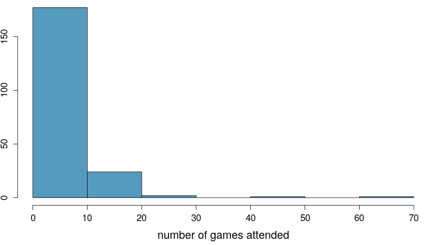
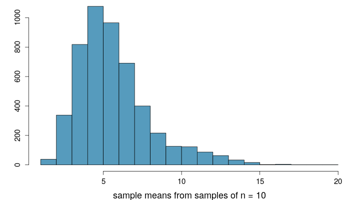
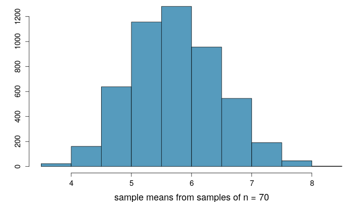
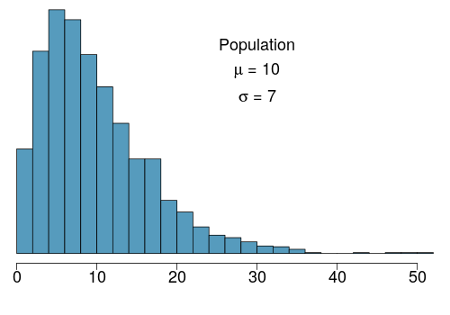
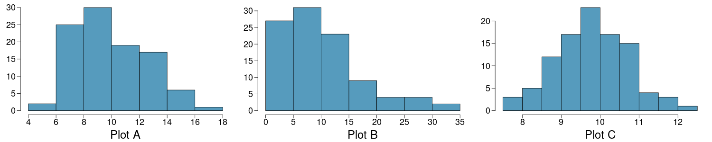

<style>
citation {
  font-size: 4px;
}
</style>

<!--  Version 1.0-0

      This version of the slides is adapted from Mine Çetinkaya-Rundel's lecture slides
      in .tex format for the Open Intro Statistics text, with some modifications, and
      moved to Rmd -> HTML.

      A large part of the HTML/CSS formatting is janky, and could be cleaned up. Feel free to issue a 
      pull request if you love HTML and CSS and want to fix this up.

      - wburr, Oct 17, 2018
-->

# The Central Limit Theorem

## The Central Limit Theorem

We discussed the Central Limit Theorem earlier in this chapter. Let's revisit it now that we know a little more about test statistics and hypothesis tests.

## Average number of basketball games attended

Consider the population data for the number of basketball games attended at Duke University.

<center>

</center>

## Average number of basketball games attended (cont.)

Sampling distribution, $n = 10$:

<div style="display: inline-block; float: left; width: 50%;">

</div>
<div style="display: inline-block; float: right; width: 50%; text-align: right;">

**What does each observation in this distribution represent?**

**Is the variability of the sampling distribution smaller or larger than the variability of the population distribution? Why?**
</div>

## Average number of basketball games attended (cont.)

Sampling distribution, $n = 10$:

<div style="display: inline-block; float: left; width: 50%;">

</div>
<div style="display: inline-block; float: right; width: 50%; text-align: right;">

**What does each observation in this distribution represent?**
    - Sample mean <br>($\bar{x}$) of samples of size $n = 10$.

**Is the variability of the sampling distribution smaller or larger than the variability of the population distribution? Why?**
</div>

## Average number of basketball games attended (cont.)

Sampling distribution, $n = 10$:

<div style="display: inline-block; float: left; width: 50%;">

</div>
<div style="display: inline-block; float: right; width: 50%; text-align: right;">

**What does each observation in this distribution represent?**
Sample mean <br>($\bar{x}$) of samples of size $n = 10$.

**Is the variability of the sampling distribution smaller or larger than the variability of the population distribution? Why?**
    - Smaller, sample means will vary less than individual observations.
</div>

## Average number of basketball games attended (cont.)

Sampling distribution, $n = 30$:

<div style="display: inline-block; float: left; width: 50%;">

</div>
<div style="display: inline-block; float: right; width: 50%; text-align: right;">
**How did the shape, center, and spread of the sampling distribution change going from $n = 10$ to $n = 30$?**
</div>


## Average number of basketball games attended (cont.)

Sampling distribution, $n = 30$:

<div style="display: inline-block; float: left; width: 50%;">

</div>
<div style="display: inline-block; float: right; width: 50%; text-align: right;">
**How did the shape, center, and spread of the sampling distribution change going from $n = 10$ to $n = 30$?** - Shape is more symmetric, center is about the same, spread is smaller.
</div>

## Average number of basketball games attended (cont.)

Sampling distribution, $n = 70$:



## Average number of basketball games attended (cont.)

The mean of the sampling distribution is 5.75, and the standard deviation of the sampling distribution (also called the **standard error**, or SE - we saw this already!) is 0.75. Which of the following is the most reasonable guess for the 95% confidence interval for the true average number of basketball games attended by students?

* $5.75 \pm 0.75$
* $5.75 \pm 2 \times 0.75$  
* $5.75 \pm 3 \times 0.75$
* cannot tell from the information given

## Average number of basketball games attended (cont.)

The mean of the sampling distribution is 5.75, and the standard deviation of the sampling distribution (also called the **standard error**, or SE - we saw this already!) is 0.75. Which of the following is the most reasonable guess for the 95% confidence interval for the true average number of basketball games attended by students?

* $5.75 \pm 0.75$
* **$5.75 \pm 2 \times 0.75 \rightarrow (4.25,7.25)$**
* $5.75 \pm 3 \times 0.75$
* cannot tell from the information given

## $\;$

<div style="margin-top: -100px; font-size: 22px;">
Four plots: Determine which plot (A, B, or C) is which. 

1. At top: distribution for a population ($\mu = 10, \sigma = 7$), 
2. a single random sample of 100 observations from this population, 
3. a distribution of 100 sample means from random samples with size 7, and 
4. a distribution of 100 sample means from random samples with size 49.
</div>

<div style="display: inline-block; float: left; width: 50%;">

</div>
<div style="display: inline-block; float: right; width: 50%; text-align: left; font-size: 22px;">
1. A - (3); B - (2); C - (4)
2. A - (2); B - (3); C - (4)
3. A - (3); B - (4); C - (2)
4. A - (4); B - (2); C - (3)
</div>

<p>




## $\;$

<div style="margin-top: -100px; font-size: 22px;">
Four plots: Determine which plot (A, B, or C) is which. 

1. At top: distribution for a population ($\mu = 10, \sigma = 7$), 
2. a single random sample of 100 observations from this population, 
3. a distribution of 100 sample means from random samples with size 7, and 
4. a distribution of 100 sample means from random samples with size 49.
</div>

<div style="display: inline-block; float: left; width: 50%;">

</div>
<div style="display: inline-block; float: right; width: 50%; text-align: left; font-size: 22px;">
1. <span id="highlight">A - (3); B - (2); C - (4)</span>
2. A - (2); B - (3); C - (4)
3. A - (3); B - (4); C - (2)
4. A - (4); B - (2); C - (3)
</div>

<p>


# Inference for other estimators

## Inference for other estimators

* The sample mean is not the only point estimate for which the sampling distribution is nearly normal. For example, the sampling distribution of sample **proportions** is also nearly normal when $n$ is sufficiently large (we'll talk about this in detail in two weeks).

## Inference for other estimators

* The sample mean is not the only point estimate for which the sampling distribution is nearly normal. For example, the sampling distribution of sample **proportions** is also nearly normal when $n$ is sufficiently large (we'll talk about this in detail in two weeks).
* An important assumption about point estimates is that they are **unbiased**, i.e. the sampling distribution of the estimate is centered at the true population parameter it estimates. 

## Inference for other estimators

* The sample mean is not the only point estimate for which the sampling distribution is nearly normal. For example, the sampling distribution of sample **proportions** is also nearly normal when $n$ is sufficiently large (we'll talk about this in detail in two weeks).
* An important assumption about point estimates is that they are **unbiased**, i.e. the sampling distribution of the estimate is centered at the true population parameter it estimates. 
    - That is, an unbiased estimate does not naturally over or underestimate the parameter. Rather, it tends to provide a "good" estimate. 
    - The sample mean is an example of an unbiased point estimate, as are each of the examples we introduce in this section.

## Inference for other estimators

* The sample mean is not the only point estimate for which the sampling distribution is nearly normal. For example, the sampling distribution of sample **proportions** is also nearly normal when $n$ is sufficiently large (we'll talk about this in detail in two weeks).
* An important assumption about point estimates is that they are **unbiased**, i.e. the sampling distribution of the estimate is centered at the true population parameter it estimates. 
    - That is, an unbiased estimate does not naturally over or underestimate the parameter. Rather, it tends to provide a "good" estimate. 
    - The sample mean is an example of an unbiased point estimate, as are each of the examples we introduce in this section.
* Some point estimates follow distributions other than the normal distribution, and some scenarios require statistical techniques that we haven't covered yet - we will discuss these later in the course, and in the next course

## Confidence intervals for nearly normal point estimates

A confidence interval based on an unbiased and nearly normal point estimate is

$$
\text{point estimate} ± z^\star SE
$$

where $z^\star$ is selected to correspond to the confidence level, and SE represents the standard error. (We've seen this before!)

Remember that the value $z^\star SE$ is called the **margin of error**.

## Practice

<div style="margin-top: -50px;">
One of the earliest examples of behavioral asymmetry is a preference in humans for turning the head to the right, rather than to the left, during the final weeks of gestation and for the first 6 months after birth. This is thought to influence subsequent development of perceptual and motor preferences. A study of 124 couples found that 64.5% turned their heads to the right when kissing. The standard error associated with this estimate is roughly 4%. Which of the below is **false**?

* The 95% confidence interval for the percentage of kissers who turn their heads to the right is roughly $64.5\% \pm 4%$.
* A higher sample size would yield a lower standard error.
* The margin of error for a 95% confidence interval for the percentage of kissers who turn their heads to the right is roughly 8\%.
* The 99.7% confidence interval for the percentage of kissers who turn their heads to the right is roughly $64.5\% \pm 12\%$.

<span style="font-size:10pt;">*Gunturkun, O. (2003), "Adult persistence of head-turning asymmetry. Nature. Volume 421.*</span>
</div>

## Practice

<div style="margin-top: -50px;">
One of the earliest examples of behavioral asymmetry is a preference in humans for turning the head to the right, rather than to the left, during the final weeks of gestation and for the first 6 months after birth. This is thought to influence subsequent development of perceptual and motor preferences. A study of 124 couples found that 64.5% turned their heads to the right when kissing. The standard error associated with this estimate is roughly 4%. Which of the below is **false**?

* <span id="highlight">The 95% confidence interval for the percentage of kissers who turn their heads to the right is roughly $64.5\% \pm 4%$.</span>
* A higher sample size would yield a lower standard error.
* The margin of error for a 95% confidence interval for the percentage of kissers who turn their heads to the right is roughly 8\%.
* The 99.7% confidence interval for the percentage of kissers who turn their heads to the right is roughly $64.5\% \pm 12\%$.

<span style="font-size:10pt;">*Gunturkun, O. (2003), "Adult persistence of head-turning asymmetry. Nature. Volume 421.*</span>
</div>

## Hypothesis testing for nearly normal point estimates

<div style="margin-top: -50px;">
The third National Health and Nutrition Examination Survey collected body fat percentage (BF%) and gender data from 13,601 subjects ages 20 to 80. The average BF% for the 6,580 men in the sample was 23.9, and this value was 35.0 for the 7,021 women. The standard error for the difference between the average men and women BF%s was 0.114. Do these data provide convincing evidence that men and women have different average BF%s. You may assume that the distribution of the point estimate is nearly normal.
</div>

## Hypothesis testing for nearly normal point estimates

<div style="margin-top: -50px;">
The third National Health and Nutrition Examination Survey collected body fat percentage (BF%) and gender data from 13,601 subjects ages 20 to 80. The average BF% for the 6,580 men in the sample was 23.9, and this value was 35.0 for the 7,021 women. The standard error for the difference between the average men and women BF%s was 0.114. Do these data provide convincing evidence that men and women have different average BF%s. You may assume that the distribution of the point estimate is nearly normal.

**The Procedure**

1. Set hypotheses
2. Calculate point estimate
3. Check conditions
4. Draw sampling distribution, shade p-value
5. Calculate test statistics and p-value, make a decision
</div>

## Body Fat Percentages

1. The null hypothesis is that men and women have equal average BF%, and the alternative is that these values are different.
$$
H_0: \mu_{men} = \mu_{women} \qquad H_A: \mu_{men} \ne \mu_{women}
$$

## Body Fat Percentages

1. The null hypothesis is that men and women have equal average BF%, and the alternative is that these values are different.
$$
H_0: \mu_{men} = \mu_{women} \qquad H_A: \mu_{men} \ne \mu_{women}
$$
2. The parameter of interest is the average difference in the population means of BF%s for men and women, and the point estimate for this parameter is the difference between the two sample means:
$$
\bar{x}_{men} - \bar{x}_{women} = 23.9 - 35.0 = -11.1
$$

## Body Fat Percentages

1. The null hypothesis is that men and women have equal average BF%, and the alternative is that these values are different.
$$
H_0: \mu_{men} = \mu_{women} \qquad H_A: \mu_{men} \ne \mu_{women}
$$
2. The parameter of interest is the average difference in the population means of BF%s for men and women, and the point estimate for this parameter is the difference between the two sample means:
$$
\bar{x}_{men} - \bar{x}_{women} = 23.9 - 35.0 = -11.1
$$
3. We are assuming that the distribution of the point estimate is nearly normal (we will discuss details for checking this condition in the next chapter, however given the large sample sizes, the normality assumption doesn't seem unwarranted).

## Body Fat Percentages

<ol start="4">
  <li>The sampling distribution will be centered at the null value <br>($\mu_{men} - \mu_{women} = 0$), and the *p*-value is the area beyond the observed difference in sample means in both tails (lower than -11.1 and higher than 11.1).</li>
</ol>

<center>

</center>

## Body Fat Percentages

<ol start="5">
  <li>The test statistic is computed as the difference between the point estimate and the null value (-11.1 - 0 = -11.1), scaled by the standard error.
$$
Z = \frac{11.1 - 0}{0.114} = 97.36
$$
The Z-score is huge! And hence the *p*-value will be tiny (essentially zero!), allowing us to reject $H_0$ in favor of $H_A$.
</ol>

## Body Fat Percentages

<ol start="5">
  <li>The test statistic is computed as the difference between the point estimate and the null value (-11.1 - 0 = -11.1), scaled by the standard error.
$$
Z = \frac{11.1 - 0}{0.114} = 97.36
$$
The Z-score is huge! And hence the *p*-value will be tiny (essentially zero!), allowing us to reject $H_0$ in favor of $H_A$.
</ol>

<p>
These data provide convincing evidence that the average BF% of men and women are different.

## Non-normal point estimates

* We may apply the ideas of confidence intervals and hypothesis testing to cases where the point estimate or test statistic is not necessarily normal. There are many reasons why such a situation may arise:
    - the sample size is too small for the normal approximation to be valid;
    - the standard error estimate may be poor; or
    - the point estimate tends towards some distribution that is not the normal distribution.

## Non-normal point estimates

* We may apply the ideas of confidence intervals and hypothesis testing to cases where the point estimate or test statistic is not necessarily normal. There are many reasons why such a situation may arise:
    - the sample size is too small for the normal approximation to be valid;
    - the standard error estimate may be poor; or
    - the point estimate tends towards some distribution that is not the normal distribution.
* For each case where the normal approximation is not valid, our first task is always to understand and characterize the sampling distribution of the point estimate or test statistic. Next, we can apply the general frameworks for confidence intervals and hypothesis testing to these alternative distributions.

## When to retreat

* Statistical tools rely on the following two main conditions:
    - **Independence**: A random sample from less than 10% of the population ensures independence of observations. In experiments, this is ensured by random assignment. If independence fails, then advanced techniques must be used, and in some such cases, inference may not be possible.
    - **Sample size and skew**: For example, if the sample size is too small, the skew too strong, or extreme outliers are present, then the normal model for the sample mean will fail.
* Whenever conditions are not satisfied for a statistical technique:
    - Learn new methods that are appropriate for the data. 
    - **Consult a statistician.**
    - **Ignore the failure of conditions.** This last option effectively invalidates any analysis and may discredit novel and interesting findings.

## Practice

All else held equal, will the p-value be lower if $n = 100$ or $n = 10,000$?

1. $n = 100$
2. $n = 10,000$

## Practice

All else held equal, will the p-value be lower if $n = 100$ or $n = 10,000$?

1. $n = 100$
2. <span id="highlight">$n = 10,000$</span>

## Practice

All else held equal, will the p-value be lower if $n = 100$ or $n = 10,000$?

1. $n = 100$
2. <span id="highlight">$n = 10,000$</span>

Suppose $\bar{x} = 50$, $s = 2$, $H_0: \mu = 49.5$, and $H_A: \mu > 49.5$.
$$
\begin{eqnarray*}
Z_{n = 100} &=& \frac{50 - 49.5}{\frac{2}{\sqrt{100}}} = \frac{50 - 49.5}{\frac{2}{10}} = \frac{0.5}{0.2} = 2.5,~~~\text{p-value} = 0.0062 \\
\end{eqnarray*}
$$

## Practice

All else held equal, will the p-value be lower if $n = 100$ or $n = 10,000$?

1. $n = 100$
2. <span id="highlight">$n = 10,000$</span>

Suppose $\bar{x} = 50$, $s = 2$, $H_0: \mu = 49.5$, and $H_A: \mu > 49.5$.
$$
\begin{eqnarray*}
Z_{n = 100} &=& \frac{50 - 49.5}{\frac{2}{\sqrt{100}}} = \frac{50 - 49.5}{\frac{2}{10}} = \frac{0.5}{0.2} = 2.5,~~~\text{p-value} = 0.0062 \\
Z_{n = 10000} &=& \frac{50 - 49.5}{\frac{2}{\sqrt{10000}}} = \frac{50 - 49.5}{\frac{2}{100}} = \frac{0.5}{0.02} = 25,~~~\text{p-value} \approx 0
\end{eqnarray*}
$$

<center>
As $n$ increases - $SE$ $\downarrow$, $Z$ $\uparrow$, p-value $\downarrow$
</center>

## Demonstration 

Imagine we test the hypothesis $H_0: \mu = 10$ vs. $H_A: \mu > 10$ for the following 8 samples. Assume $\sigma = 2$.

$\bar{x}$      $10.05$       $10.10$        $10.2$   
----------     ------------  -----------    -----------
$n=30$         *p* = 0.45    *p* = 0.39     *p* = 0.29
$n=5000$

## Demonstration 

Imagine we test the hypothesis $H_0: \mu = 10$ vs. $H_A: \mu > 10$ for the following 8 samples. Assume $\sigma = 2$.

$\bar{x}$      $10.05$       $10.10$        $10.2$   
----------     ------------  -------------  -----------
$n=30$         *p* = 0.45    *p* = 0.39     *p* = 0.29
$n=5000$       *p* = 0.04    *p* = 0.0002   *p* $\approx 0$

## Demonstration 

Imagine we test the hypothesis $H_0: \mu = 10$ vs. $H_A: \mu > 10$ for the following 8 samples. Assume $\sigma = 2$.

$\bar{x}$      $10.05$       $10.10$        $10.2$   
----------     ------------  -------------  -----------
$n=30$         *p* = 0.45    *p* = 0.39     *p* = 0.29
$n=5000$       *p* = 0.04    *p* = 0.0002   *p* $\approx 0$

<p>
When $n$ is large, even small deviations from the null (small **effect sizes**), which may be considered practically insignificant, can yield statistically significant results.

## Statistical vs. practical significance

* Real differences between the point estimate and null value are easier to detect with larger samples.
* However, very large samples will result in statistical significance even for tiny differences between the sample mean and the null value (**effect size**), even when the difference is not practically significant.
* This is especially important to research: if we conduct a study, we want to focus on finding meaningful results (we want observed differences to be real, but also large enough to matter).
* The role of a statistician is not just in the analysis of data, but also in planning and design of a study.

## Aphorism

"To call in the statistician after the experiment is done may be no more than asking him to perform a postmortem
examination: he may be able to say what the experiment died of." - Sir Ronald Aylmer Fisher, Address to Indian Statistical Congress (1938)

**It's ok to need help: you're not statisticians, and you won't be at the end of this class!**

# The *t* Distribution

## A Specific Example of Non-Normal

In the last discussion, we talked about how we might approach certain problems where the **normal assumption** does not hold. We're now going to start looking at a specific, famous example of this kind of problem - the *t* distribution.

## Case Study: Friday the 13th

Between 1990 - 1992 researchers in the UK collected data on traffic flow, accidents, and hospital admissions on Friday 13th and the previous Friday, Friday 6th. Below is an excerpt from this data set on traffic flow. We can assume that traffic flow on a given day at locations 1 and 2 are independent.

<center>
```{r, out.width = "750px", echo = FALSE}
knitr::include_graphics("fig/fig_4_1_friday_13.png")
```
</center>
<span style="font-size:10pt;">Scanlon, T.J., Luben, R.N., Scanlon, F.L., Singleton, N. (1993), “Is Friday the 13th Bad For Your Health?” BMJ, 307, 1584-1586.</span>

## Friday the 13th

We want to investigate if people's behavior is different on Friday 13th compared to Friday 6th.
One approach is to compare the traffic flow on these two days.

  * $H_0$: Average traffic flow on Friday 6th and 13th are equal.
  * $H_A$: Average traffic flow on Friday 6th and 13th are different.
  
Each case in the data set represents traffic flow recorded at the same location in the same month of the same year: one count from Friday 6th and the other Friday 13th. Are these two counts independent?

## Friday the 13th

We want to investigate if people's behavior is different on Friday 13th compared to Friday 6th.
One approach is to compare the traffic flow on these two days.

  * $H_0$: Average traffic flow on Friday 6th and 13th are equal.
  * $H_A$: Average traffic flow on Friday 6th and 13th are different.
  
Each case in the data set represents traffic flow recorded at the same location in the same month of the same year: one count from Friday 6th and the other Friday 13th. Are these two counts independent?

**No**

## Hypotheses

What are the hypotheses for testing for a difference between the average traffic flow between Friday 6th and 13th?

  * $H_0: \mu_\text{6th} = \mu_\text{13th} \qquad \text{versus} H_A: \mu_\text{6th} \neq \mu_\text{13th}$
  * $H_0: p_\text{6th} = p_\text{13th} \qquad \text{versus} H_A: p_\text{6th} \neq p_\text{13th}$
  * $H_0: \mu_\text{diff} = 0 \qquad \text{versus} \qquad H_A: \mu_\text{diff} \neq 0$
  * $H_0: \bar{x}_\text{diff} = 0 \qquad \text{versus} \qquad H_A: \bar{x}_\text{diff} \neq 0$

## Hypotheses 

What are the hypotheses for testing for a difference between the average traffic flow between Friday 6th and 13th?

  * $H_0: \mu_\text{6th} = \mu_\text{13th} \qquad \text{versus} \qquad H_A: \mu_\text{6th} \neq \mu_\text{13th}$
  * $H_0: p_\text{6th} = p_\text{13th} \qquad \text{versus} \qquad H_A: p_\text{6th} \neq p_\text{13th}$
  * <span id="highlight">$H_0: \mu_\text{diff} = 0 \qquad \text{versus} \qquad H_A: \mu_\text{diff} \neq 0$</span>
  * $H_0: \bar{x}_\text{diff} = 0 \qquad \text{versus} \qquad H_A: \bar{x}_\text{diff} \neq 0$

## A Plot of the Data
<center>
```{r, out.width = "750px", echo = FALSE}
knitr::include_graphics("fig/fig_4_1_friday_13_plot.png")
```
</center>

## Conditions

**Independence**: we are told to assume that the cases (rows in the table) are independent

**Sample size/skew**: the sample distribution, shown on the last slide, does not seem to be extremely skewed, but it's very  difficult to assess with such a small sample size. We might want to think about whether we would expect the population distribution to be skewed or not -- probably not, as it should be equally likely to have days with lower than average traffic and higher than average traffic.

**Note**: $n < 30$!

So what do we do when the sample size is small?

## Review: Purpose of Large Sample
As long as observations are independent, and the population distribution is not extremely skewed, a large sample would ensure that:

  * the sampling distribution of the mean is nearly normal
  * the estimate of the standard error (SE) , as $\frac{s}{\sqrt{n}}$, is reliable
  
## The normality condition
The CLT, which states that sampling distributions will be nearly normal, holds true for any sample size as long as the population distribution is nearly normal.

While this is a helpful special case, it's inherently difficult to verify normality in small data sets.

We should exercise caution when verifying the normality condition for small samples. It is important to not only examine the data but also think about where the data come from.

For example, ask: would I expect this distribution to be symmetric, and am I confident that outliers are rare?
  
## The $t$ Distribution
When working with small samples, and the population standard deviation is unknown (almost always), the uncertainty of the standard error estimate is addressed by using a new distribution: the $t$ distribution.

This distribution also has a bell shape, but its tails are thicker than the normal model's.

Therefore observations are more likely to fall beyond two SDs from the mean than under the normal distribution.

These extra thick tails are helpful for resolving our problem with a less reliable estimate the standard error (since $n$ is small)
  
## A plot of $t$ versus $\mathcal{N}$

```{r, echo = FALSE, fig.width = 9}
x <- seq(-4.5, 4.5, 0.001)
plot(x, dnorm(x), type = "l", xlab = "", ylab = "", yaxt = 'n')
lines(x, dt(x, 2), col = "blue", lty = 2)
legend(x = "topright", col = c("black", "blue"), lty = c(1, 2), legend = c("Normal", "t"))
```

## The $t$ Distribution (ctd.)

Always centered at zero, like the standard normal ($z$) distribution.

Has a single parameter: degrees of freedom ($df$) -- like $\chi^2$.

What happens to the shape of the $t$ distribution as $df$ increases?

## The $t$ Distribution (ctd.)

```{r, echo = FALSE, fig.width = 10}
x <- seq(-4.5, 4.5, 0.001)
plot(x, dnorm(x), type = "l", xlab = "", ylab = "", yaxt = 'n')
lines(x, dt(x, 5), col = "grey60", lty = 1)
lines(x, dt(x, 10), col = "grey60", lty = 1)
lines(x, dt(x, 15), col = "grey60", lty = 1)
lines(x, dt(x, 20), col = "grey60", lty = 1)
lines(x, dt(x, 25), col = "grey60", lty = 1)
```
As $df \longrightarrow \infty$, the $t$ distribution approaches the normal!

## Asymptotic

What $df$ is required to give arbitrary decimal agreement between the $t$ and $z$ curves?

* 2 decimals: $df = 14$
* 3 decimals: $df = 136$
* 4 decimals: $df = 1370$

What do we usually ask for? 30 $df$ corresponds to 3 decimals for the $[-3, 3]$ domain, which is good enough. So once $df > 30$, just use a $z$ instead.

## Back to Friday the 13th
<center>
```{r, out.width = "750px", echo = FALSE}
knitr::include_graphics("fig/fig_4_1_friday_13.png")
```
</center>

We have, from this table:

* $\bar{x}_\text{diff} = 1836$
* $s_\text{diff} = 1176$
* $n=10$

## Finding the test statistic

<div style="margin-top: -40px;">
The test statistic for inference on a small-sample mean ($n<50$) is the $t$ statistic with $df = n-1$.

$$
t_\text{df} = \frac{\text{point estimate} - \text{null value}}{SE}
$$
In this context, these become:

* Point Estimate: $\bar{x}_\text{diff} = 1836$
* SE: $SE = \frac{s_\text{diff}}{\sqrt{n}} = \frac{1176}{\sqrt{10}} = 371.88$
* $t$: $t = \frac{1836 - 0}{371.88} = 4.937$
* $df$: $df = 10- 1 = 9$

**Note**: the null value is $0$ here because the null hypothesis we set at the start of the lecture is $\mu_\text{diff} = 0$.
</div>

## Finding the *p*-value

The *p*-value of this test statistic is, again, the tail area under the null (*t*) distribution.

```{r}
2 * pt(4.937, df = 9, lower.tail = FALSE)
```

Since this *p*-value is smaller than an arbitrary $\alpha = 0.05$, we would conclude at a 95% level of significance that our mean difference is **not** 0. Thus, the data provide convincing evidence of a difference between traffic flow on Friday the 6th and Friday the 13th. 

## A graphical display

<center>
```{r, echo = FALSE}
x <- seq(-5, 5, 0.01)
plot(x, dt(x, 9), type = "l", xlab = "", ylab = "", yaxt = 'n', xaxt = 'n')
axis(side = 1, at = c(-4.937, -4, -3, -2, -1, 0, 1, 2, 3, 4, 4.937))
abline(h = 0)
abline(v = c(-4.937, 4.937), col = "blue")
```
</center>

## What is the difference?
We concluded that there is a difference in the traffic flow between Friday 6th and 13th.

But it would be more interesting to find out what exactly this difference is.

We can use a confidence interval to estimate this difference.

## Confidence intervals for a small-sample mean

Confidence intervals are always of the form
$$
   \text{point estimate} \pm \text{ME}
$$

ME is always calculated as the product of a critical value (remember: $z^*$) and SE.

Since small-sample means follow a $t$ distribution (and not a $z$ distribution), the critical value is a $t^*$
(as opposed to a $z^*$).

$$
 \text{point estimate} \pm t^* \times \text{SE}
$$

## Finding the critical $t^*$

Since $n=10$, we have $df = 10 - 1 = 9$. 

```{r}
qt(0.025, df = 9)
qt(0.975, df = 9)
```

## Practice

Which of the following is the correct calculation of a 95% confidence interval for the difference between the traffic flow between Friday 6th and 13th?

$\bar{x}_\text{diff} = 1836$, $s_\text{diff} = 1176$ and $n = 10$, with $SE = 371.88$.

  * $1836 \pm 1.96 \times 372$
  * $1836 \pm 2.26 \times 372$
  * $1836 \pm 2.26 \times 1176$
  
## Practice

Which of the following is the correct calculation of a 95% confidence interval for the difference between the traffic flow between Friday 6th and 13th?

$\bar{x}_\text{diff} = 1836$, $s_\text{diff} = 1176$ and $n = 10$, with $SE = 371.88$.

  * $1836 \pm 1.96 \times 372$
  * <span id="highlight">$1836 \pm 2.26 \times 372 \longrightarrow (995, 2677)$</span>
  * $1836 \pm 2.26 \times 1176$
  
## Interpreting the CI

Which of the following is the best interpretation for the confidence interval we just calculated?
$$
\mu_\text{diff: 6th - 13th} = (995, 2677)
$$

We are 95% confident that ...

* the difference between the average number of cars on the road on Friday 6th and 13th is between 995 and 2,677.
* on Friday 6th there are 995 to 2,677 fewer cars on the road than on the Friday 13th, on average.
* on Friday 6th there are 995 fewer to 2,677 more cars on the road than on the Friday 13th, on average.
* on Friday 13th there are 995 to 2,677 fewer cars on the road than on the Friday 6th, on average.
  
## Interpreting the CI

Which of the following is the best interpretation for the confidence interval we just calculated?
$$
\mu_\text{diff: 6th - 13th} = (995, 2677)
$$

We are 95% confident that ...

* the difference between the average number of cars on the road on Friday 6th and 13th is between 995 and 2,677.
* on Friday 6th there are 995 to 2,677 fewer cars on the road than on the Friday 13th, on average.
* on Friday 6th there are 995 fewer to 2,677 more cars on the road than on the Friday 13th, on average.
* <span id="highlight">on Friday 13th there are 995 to 2,677 fewer cars on the road than on the Friday 6th, on average</span>.

## Synthesis

Does the conclusion from the hypothesis test agree with the findings of the confidence interval?

<br>
<p>

Do you think the findings of this study suggests that people believe Friday 13th is a day of bad luck?

## Synthesis

Does the conclusion from the hypothesis test agree with the findings of the confidence interval?

<span id = "highlight">Yes, the hypothesis test found a significant difference, and the CI does not contain the null value of 0.</span>

Do you think the findings of this study suggests that people believe Friday 13th is a day of bad luck?

<span id="highlight">No, this is an observational study. We have just observed a significant difference between the number of cars on the road on these two days. We have not tested for people's beliefs.</span>
 
## Recap: Inference using a small sample mean
If $n < 30$, sample means follow a $t$ distribution with $\text{SE} = \frac{s}{\sqrt{n}}$.

1. **Conditions**:
    - independence of observations (often verified by a random sample, and if sampling without replacement, $n < 10\%$ of population)
    - $n < 30$ and no extreme skew
2. **Hypothesis Testing**: 
$$
t_\text{df} = \frac{\text{point estimate} - \text{null value}}{SE}, \text{ where } df = n-1.
$$
3. **Confidence Interval**:
$$
\text{point estimate} \pm t_{df}^* \times SE.
$$

## One Final Note

**Note**: The example we used was for paired means (difference between dependent groups). We took the difference between the observations and used only these differences (one sample) in our analysis, therefore the mechanics are the same as when we are working with just one sample.

<br>
This is the next topic we'll cover!
