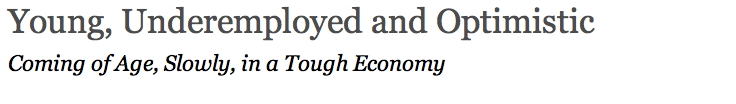
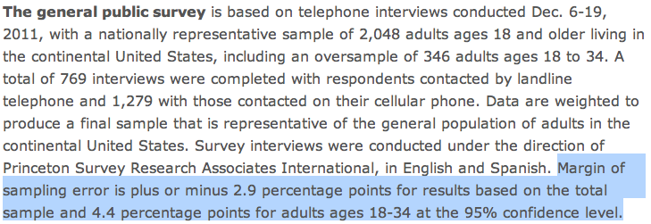
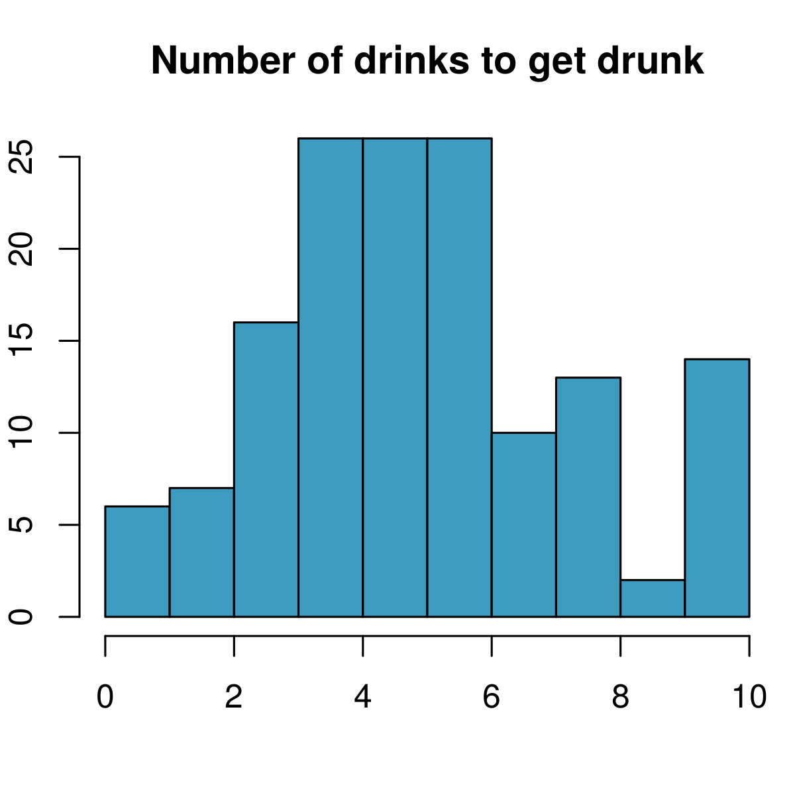
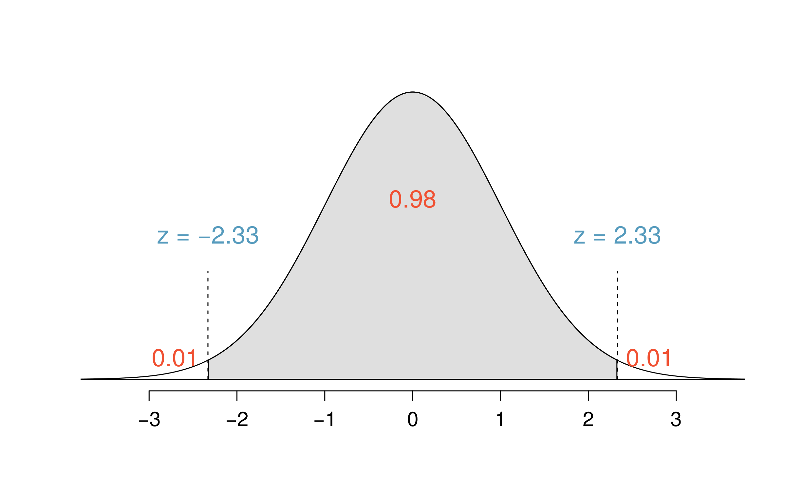

<style>
citation {
  font-size: 4px;
}
</style>

<!--  Version 1.0-0

      This version of the slides is adapted from Mine Çetinkaya-Rundel's lecture slides
      in .tex format for the Open Intro Statistics text, with some modifications, and
      moved to Rmd -> HTML.

      A large part of the HTML/CSS formatting is janky, and could be cleaned up. Feel free to issue a 
      pull request if you love HTML and CSS and want to fix this up.

      - wburr, Oct 17, 2018
-->

<!-- This is Chapter 2.1 in the IntroStat text, slides by Mine Cetinkaya-Rundel -->
# Case Study: Gender Discrimination

## Gender Discrimination

* In 1972, as a part of a study on gender discrimination, 48 male bank supervisors were each given the same personnel file and asked to judge whether the person should be promoted to a branch manager job that was described as “routine”.
* The files were identical except that half of the supervisors had files showing the person was male while the other half had files showing the person was female.
* It was randomly determined which supervisors got “male” applications and which got “female” applications.
* Of the 48 files reviewed, 35 were promoted.
* The study is testing whether females are unfairly discriminated against.
* Is this an observational study or an experiment?


<span style="font-size:10pt;">*B.Rosen and T. Jerdee (1974), "Influence of sex role stereotypes on personnel decisions", J.Applied Psychology, 59:9-14.*</span>

## Data

At a first glance, does there appear to be a relationship between promotion and gender?

```{r, makeOutcomeTable2_1, echo = FALSE}
library("kableExtra")
library("knitr")
options(knitr.table.format = "html") 
dt <- data.frame("Yes" = c(21, 14, 35), "No" = c(3, 10, 13), "Total" = c(24, 24, 48))
row.names(dt) <- c("Male", "Female", "")
kable(dt, align = 'ccc') %>%
  kable_styling("striped", full_width = FALSE, position = "center", font_size = 20) %>%
  add_header_above(c(" " = 1, "Promoted" = 2, " " = 1)) %>%
  group_rows("Gender", 1, 2) %>%
  group_rows("Total", 3, 3)
```

**% of males promoted**: 21 / 24 = 0.875

**% of females promoted**: 14 / 24 = 0.583

## Practice

We saw a difference of almost 30% (29.2% to be exact) between the proportion of male and female files that are promoted. Based on this information, which of the below is true?

1. If we were to repeat the experiment we will definitely see that more female files get promoted. This was a fluke.
2. Promotion is dependent on gender, males are more likely to be promoted, and hence there is gender discrimination against women in promotion decisions.
3. The difference in the proportions of promoted male and female files is due to chance, this is not evidence of gender discrimination against women in promotion decisions.
4. Women are less qualified than men, and this is why fewer females get promoted.

## Practice

We saw a difference of almost 30% (29.2% to be exact) between the proportion of male and female files that are promoted. Based on this information, which of the below is true?

1. If we were to repeat the experiment we will definitely see that more female files get promoted. This was a fluke.
2. <span id="highlight">Promotion is dependent on gender, males are more likely to be promoted, and hence there is gender discrimination against women in promotion decisions.</span>  <span style="color:red;">Maybe!</span>
3. <span id="highlight">The difference in the proportions of promoted male and female files is due to chance, this is not evidence of gender discrimination against women in promotion decisions.</span>  <span style="color:red;">Maybe!</span>
4. Women are less qualified than men, and this is why fewer females get promoted.

## Two Competing Claims

<div style="font-size:22px;">
“There is nothing going on.” (**Null Hypothesis**)

Promotion and gender are **independent**.

No gender discrimination.

Observed difference in proportions is simply due to chance.

<hr>
<center>**versus**</center>
<hr>

There is something going on.” (**Alternative Hypothesis**)

Promotion and gender are **dependent**.

There is gender discrimination.

Observed difference in proportions is not due to chance.
</div>

## We Will Return!

We will continue with the concept of hypothesis testing later in this lecture, and over the following weeks. 
First, lets develop some other ideas.

# Variability in estimates

## $\;$
<div style = "margin-top: -90px;">
<center>
<br />
<br />
<br />
</center>
</div>

<center>
<span style="font-size:10pt; font-style: oblique; ">http://pewresearch.org/pubs/2191/young-adults-workers-labor-market-pay-careers-advancement-recession</span>
</center>

## Margin of error

<center>

</center>

* 41% $\pm$ 2.9%: We are 95% confident that 38.1% to 43.9% of the public believe young adults, rather than middle-aged or older adults, are having the toughest time in today's economy.
* 49% $\pm$ 4.4%: We are 95% confident that 44.6% to 53.4% of 18-34 years olds have taken a job they didn't want just to pay the bills.

## Parameter estimation

* We are often interested in **population parameters**.
* Since complete populations are difficult (or impossible) to collect data on, we use **sample statistics** as **point estimates** for the unknown population parameters of interest.
* Sample statistics vary from sample to sample.
* Quantifying how sample statistics vary provides a way to estimate the **margin of error** associated with our point estimate.
* But before we get to quantifying the variability among samples, let's try to understand how and why point estimates vary from sample to sample.

## Parameter estimation

Suppose we randomly sample 1,000 adults from each state in the US. Would
you expect the sample means of their heights to be the same, somewhat different, or very different?

**Not the same, but only somewhat different.**


## $\;$

<div style="margin-top: -100px;">
The following histogram shows the distribution of number of drinks it takes a group of college students to get drunk. We will assume that this is our population of interest. If we randomly select observations from this data set, which values are most likely to be selected (which are least likely)?

<center>

</center>
</div>

## $\;$

<div style="margin-top: -100px;">
Suppose that you don't have access to the population data. In order to estimate the average number of drinks it takes these college students to get drunk, you might sample from the population and use your sample mean as the best guess for the unknown population mean.

* Sample, with replacement, ten students from the population, and record the number of drinks it takes them to get drunk.
* Find the sample mean.
* Plot the distribution of the sample averages  obtained by members of the class.

</div>

## $\;$

<center>

</center>

## $\;$

**Example:** List of random numbers: 59, 121,  88,  46,  58,  72,  82,  81,   5,  10 

<center>

</center>
<br/>

**Sample mean**: $\frac{8+6+10+4+5+3+5+6+6+6}{10} = 5.9$

## Sampling distribution

What you just constructed is called a *sampling distribution*.

What is the shape and center of this distribution? Based on this distribution, what do you think is the true population average?

## Sampling distribution

What you just constructed is called a *sampling distribution*.

What is the shape and center of this distribution? Based on this distribution, what do you think is the true population average?

**Approximately 5.39, the true population mean.**

# Sampling distributions - via CLT

## Central limit theorem

**Central limit theorem**
The distribution of the sample mean is well approximated by a normal model:
$$
\bar{x} \sim \mathcal{N} \left(\text{mean} = \mu, \text{SE} = \frac{\sigma}{\sqrt{n}} \right),
$$
where SE is represents **standard error**, which is defined as the standard deviation of the sampling distribution. If $\sigma$ is unknown, use $s$ (recall: standard deviation of sample).

## Central limit theorem

* It wasn't a coincidence that the sampling distribution we saw earlier was symmetric, and centered at the true population mean.
* We won't go through a detailed proof of why $SE =  \frac{\sigma}{\sqrt{n}}$, but note that as $n$ increases $SE$ decreases. 
    - As the sample size increases we would expect samples to yield more consistent sample means, hence the variability among the sample means would be lower.

## CLT - conditions

Certain conditions must be met for the CLT to apply:

* **Independence:** Sampled observations must be independent. 
This is difficult to verify, but is more likely if
    - random sampling/assignment is used, and
    - if sampling without replacement, $n$ $<$ 10\% of the population.

## CLT - conditions

Certain conditions must be met for the CLT to apply:

* **Independence:** Sampled observations must be independent. 
This is difficult to verify, but is more likely if
    - random sampling/assignment is used, and
    - if sampling without replacement, $n$ $<$ 10\% of the population.
* **Sample size/skew:** Either the population distribution is normal, or if the population distribution is skewed, the sample size is large.
This is also difficult to verify for the population, but we can check it using the sample data, and assume that the sample mirrors the population.
    - the more skewed the population distribution, the larger sample size we need for the CLT to apply
    - for moderately skewed distributions $n>30$ is a widely used rule of thumb

# Confidence intervals

## Why do we report confidence intervals?

* A plausible range of values for the population parameter is called a **confidence interval**.
* Using only a sample statistic to estimate a parameter is like **fishing with a spear** in a murky lake, and using a confidence interval is like **fishing with a net**.
* We can throw a spear where we saw a fish but we will probably miss. If we toss a net in that area, we have a good chance of catching the fish.

So the analogy: if we report a point estimate, we probably won't hit the exact population parameter. If we report a range of plausible values we have a good shot at capturing the parameter. 

## Average number of exclusive relationships

A random sample of 50 college students were asked how many exclusive relationships they have been in so far. This sample yielded a mean of 3.2 and a standard deviation of 1.74. Estimate the true average number of exclusive relationships using this sample.

$$
\bar{x} = 3.2 \qquad s = 1.74
$$

<span style="font-color: blue;">
The approximate 95% confidence interval is defined as 
$$
\text{point estimate} \pm 2 \times \text{SE}
$$
</span>

$$
SE = \frac{s}{\sqrt{n}} = \frac{1.74}{\sqrt{50}} \approx 0.25
$$

## Average number of exclusive relationships

A random sample of 50 college students were asked how many exclusive relationships they have been in so far. This sample yielded a mean of 3.2 and a standard deviation of 1.74. Estimate the true average number of exclusive relationships using this sample.

$$
\bar{x} = 3.2 \qquad s = 1.74
$$

$$
\begin{eqnarray*}
\bar{x} \pm 2 \times SE &=& 3.2 \pm 2 \times 0.25 \\
&=& (3.2 - 0.5, 3.2 + 0.5) \\
&=& (2.7, 3.7)
\end{eqnarray*}
$$

## Practice

Which of the following is the correct interpretation of this confidence interval?

We are 95% confident that

* the average number of exclusive relationships college students in this sample have been in is between 2.7 and 3.7.
* college students on average have been in between 2.7 and 3.7 exclusive relationships.
* a randomly chosen college student has been in 2.7 to 3.7 exclusive relationships.
* 95% of college students have been in 2.7 to 3.7 exclusive relationships.

## Practice

Which of the following is the correct interpretation of this confidence interval?

We are 95% confident that

* the average number of exclusive relationships college students in this sample have been in is between 2.7 and 3.7.
* <span id="highlight">college students on average have been in between 2.7 and 3.7 exclusive relationships.</span>
* a randomly chosen college student has been in 2.7 to 3.7 exclusive relationships.
* 95% of college students have been in 2.7 to 3.7 exclusive relationships.

## A more accurate interval

**Confidence interval, a general formula**
$$
\text{point estimate} \pm z^\star \cdot SE
$$

Conditions when the point estimate = $\bar{x}$:

* **Independence:** Observations in the sample must be independent
    - random sample/assignment
    -  if sampling without replacement, $n <$ 10% of population
* **Sample size / skew:** $n \ge 30$ and population distribution should not be extremely skewed

**Note:** We will discuss working with samples where $n < 30$ later.


## Capturing the population parameter

What does 95\% confident mean?

* Suppose we took many samples and built a confidence interval from each sample using the equation $\text{point estimate} \pm 2 \cdot SE$.
* Then about 95% of those intervals would contain the true population $\mu$.

<div style="display: inline-block; float: left; width: 50%;">
* The figure to the right shows this process with 25 samples, where 24 of the resulting confidence intervals contain the true average number of exclusive relationships, and one does not.
</div>
<div style="display: inline-block; float: right; width: 50%; text-align: right;">

</div>

## Width of an interval

If we want to be more certain that we capture the population parameter, *i.e.*, increase our confidence level, should we use a wider interval or a smaller interval?

## Width of an interval

If we want to be more certain that we capture the population parameter, i.e. increase our confidence level, should we use a wider interval or a smaller interval?

**A wider interval.**

## Width of an interval

If we want to be more certain that we capture the population parameter, i.e. increase our confidence level, should we use a wider interval or a smaller interval?

**A wider interval.**

Can you see any drawbacks to using a wider interval?

## Width of an interval

If we want to be more certain that we capture the population parameter, i.e. increase our confidence level, should we use a wider interval or a smaller interval?

**A wider interval.**

Can you see any drawbacks to using a wider interval?

<center>

</center>

**If the interval is too wide it may not be very informative.**

<span style = "font-size: 10px; font-style: oblique;">http://web.as.uky.edu/statistics/users/earo227/misc/garfield_weather.gif</span>

## Changing the confidence level

$$
\text{point estimate} \pm z^\star \cdot SE
$$

* In a confidence interval, $z^\star \cdot SE$ is called the **margin of error** (ME), and for a given sample, the margin of error changes as the confidence level changes.
* In order to change the confidence level we need to adjust $z^\star$ in the above formula.
* Commonly used confidence levels in practice are 90%, 95%, 98%, and 99%.
* For a 95% confidence interval, $z^\star = 1.96$.
* However, using the standard normal ($z$) distribution, it is possible to find the appropriate $z^\star$ for any confidence level.

## Practice 

Which of the below Z scores is the appropriate $z^\star$ when calculating a 98% confidence interval?

<div style="display: inline-block; float: left; width: 50%;">
* $Z = 2.05$
* $Z = 1.96$
* $Z = 2.33$
* $Z = -2.33$
* $Z = -1.65$
</div>
<div style="display: inline-block; float: right; width: 50%; text-align: right;">
<center>
<!---->
</center>
</div>

## Practice 

Which of the below Z scores is the appropriate $z^\star$ when calculating a 98% confidence interval?

<div style="display: inline-block; float: left; width: 50%;">
* $Z = 2.05$
* $Z = 1.96$
* $Z = 2.33$
* $Z = -2.33$
* $Z = -1.65$
</div>
<div style="display: inline-block; float: right; width: 50%; text-align: right;">
<center>

</center>
</div>

# Hypothesis Testing

## Hypothesis Tests as a Trial
<span style="font-size:22px;">
Hypothesis testing is very much like a court trial.
<div style= "float:right;position: relative; top: -20px;">

```{r, echo=FALSE, out.width = "350px"}
knitr::include_graphics("fig/fig_2_1_trial.png")
```
</div>
<div style="position:relative; bottom:20px;">&nbsp;</div>
* $H_0$: defendent is innocent (English common law; Justinian Codes, UN Declaration of Human Rights), *versus* <br />
 $H_A$: defendent is guilty
* We then present the evidence $-$ collect data
* Then we judge the evidence: "Could these data plausibly have happened by chance if the null hypothesis were true?"
    * If they were very unlikely to have occurred, then the evidence raises more than *a reasonable doubt* in our minds about the null hypothesis
* Ultimately, we must make a decision: how unlikely is **unlikely**?
</span>

<center>
<span style="font-size:10pt;">*Image from http://www.nwherald.com/_internal/cimg!0/oo1il4sf8zzaqbboq25oevvbg99wpot</span>*</span>
</center>

## A Hypothesis Test as a Trial (continued)

* If the evidence is not strong enough to reject the assumption of innocence, the jury returns with a verdict of "not guilty".
    * The jury does not say that the defendant is innocent, just that there is not enough evidence to convict.
    * The defendant may, in fact, be innocent, but the jury has no way of being sure.
* Said statistically, we **fail to reject the null hypothesis**.
    * We never declare the null hypothesis to be true, because we simply do not know whether it's true or not.
    * Therefore we never "accept the null hypothesis".

## A Hypothesis Test as a Trial (continued)

* In a trial, the burden of proof is on the prosecution.
* In a hypothesis test, the burden of proof is on the unusual claim.
*  The null hypothesis is the ordinary state of affairs (the status quo), so it's the alternative hypothesis that we consider unusual and for which we must gather evidence.

## Recap: Concept of Hypothesis Testing 
* We start with a **null hypothesis** ($H_0$) that represents the status quo.
* We also have an **alternative hypothesis** ($H_A$) that represents our research question, i.e. what we're testing for.
* We conduct a hypothesis test under the assumption that the null hypothesis is true, either via simulation (today) or theoretical methods (later in the course).
* If the test results suggest that the data do not provide convincing evidence for the alternative hypothesis, we stick with the null hypothesis. If they do, then we reject the null hypothesis in favor of the alternative.

## Back to the example of gender discrimination ...

<center>

</center>

Since it was quite unlikely to obtain results like the actual data or something more extreme in the simulations (male promotions being 30% or more higher than female promotions), we would decide to reject the null hypothesis in favor of the alternative.

# Testing Hypotheses: CIs

## Testing hypotheses using confidence intervals

Earlier we calculated a 95% confidence interval for the average number of exclusive relationships college students have been in to be (2.7, 3.7). Based on this confidence interval, do these data support the hypothesis that college students on average have been in more than 3 exclusive relationships?

* The associated hypotheses are:
    - $H_0$: $\mu = 3$: College students have been in 3 exclusive relationships, on average
    - $H_A$: $\mu > 3$: College students have been in more than 3 exclusive relationships, on average

## Testing hypotheses using confidence intervals

Earlier we calculated a 95% confidence interval for the average number of exclusive relationships college students have been in to be (2.7, 3.7). Based on this confidence interval, do these data support the hypothesis that college students on average have been in more than 3 exclusive relationships?

* The associated hypotheses are:
    - $H_0$: $\mu = 3$: College students have been in 3 exclusive relationships, on average
    - $H_A$: $\mu > 3$: College students have been in more than 3 exclusive relationships, on average
* Since the null value is included in the interval, we do not reject the null hypothesis in favor of the alternative.
* This is a quick-and-dirty approach for hypothesis testing. However it doesn't tell us the likelihood of certain outcomes under the null hypothesis, i.e., the *p*-value, based on which we can make a decision on the hypotheses.

# Hypothesis Testing

## Concept of Hypothesis Testing 

* We start with a **null hypothesis** ($H_0$) that represents the status quo.
* We also have an **alternative hypothesis** ($H_A$) that represents our research question, i.e. what we're testing for.
* We conduct a hypothesis test under the assumption that the null hypothesis is true, either via simulation (today) or theoretical methods (later in the course).
* If the test results suggest that the data do not provide convincing evidence for the alternative hypothesis, we stick with the null hypothesis. If they do, then we reject the null hypothesis in favor of the alternative.

## Testing hypotheses using confidence intervals

Earlier we calculated a 95% confidence interval for the average number of exclusive relationships college students have been in to be (2.7, 3.7). Based on this confidence interval, do these data support the hypothesis that college students on average have been in more than 3 exclusive relationships?

* The associated hypotheses are:
    - $H_0$: $\mu = 3$: College students have been in 3 exclusive relationships, on average
    - $H_A$: $\mu > 3$: College students have been in more than 3 exclusive relationships, on average

## Testing hypotheses using confidence intervals

Earlier we calculated a 95% confidence interval for the average number of exclusive relationships college students have been in to be (2.7, 3.7). Based on this confidence interval, do these data support the hypothesis that college students on average have been in more than 3 exclusive relationships?

* The associated hypotheses are:
    - $H_0$: $\mu = 3$: College students have been in 3 exclusive relationships, on average
    - $H_A$: $\mu > 3$: College students have been in more than 3 exclusive relationships, on average
* Since the null value is included in the interval, we do not reject the null hypothesis in favor of the alternative.
* This is a quick-and-dirty approach for hypothesis testing. However it doesn't tell us the likelihood of certain outcomes under the null hypothesis, i.e., the *p*-value, based on which we can make a decision on the hypotheses.

## Recall

Confidence intervals for the population mean $\mu$ from large samples have the form
$$
\bar{x} \pm \text{ME} = \bar{x} \pm z^\star \cdot \text{SE}
$$
and explicitly, the Standard Error, $\text{SE}$, is
$$
\text{SE} = \frac{\sigma}{\sqrt{n}}.
$$

# Examples

## Example 1

Maple Leaf receives a large shipment of turkeys carcasses for packaging and sale, and the 
manager wants to determine if the true mean weight of the turkeys meets their requirement of 3.7 kg per turkey, on average.
A random sample of 36 turkeys yields a sample mean weight of 3.6 kg., with a sample standard deviation of 0.61 kg. Does the shipment satisfy Maple Leaf’s requirement? (Note: it would be very costly to reject a shipment incorrectly.) 
Complete a test of hypothesis using a confidence interval.

## Example 1

Key information:

* $\mu = 3.7$
* $\bar{x} = 3.6$
* $s = 0.61$
* $n = 36$

## Example 1: the CI

Compute the confidence interval:

$$
\bar{x} \pm z^\star \cdot \frac{s}{\sqrt{n}} = 3.6 \pm z^\star \cdot \frac{0.61}{\sqrt{36}}
$$
What is $z^\star$? The question says that a "mistake will be very costly" - so we really don't want to make a mistake! This 
corresponds to a high degree of confidence, so let's say 99%, which is $\alpha/2 = 0.005$. Then:
```{r}
qnorm(1 - 0.01/2)
```

## Example 1: finishing

$$
\bar{x} \pm z^\star \cdot \frac{s}{\sqrt{n}} = 3.6 \pm 2.576 \cdot \frac{0.61}{\sqrt{36}} = (3.3381, 3.8619)
$$

Since this confidence interval **includes** the null hypothesis of 3.7, we **fail to reject the null hypothesis**, and this shipment probably meets the company's requirement.

## Number of university applications

A survey asked how many universities students applied to, and 206 students responded to this question. This sample yielded an average of 9.7 universitiy applications with a standard deviation of 7. A government website states that counselors recommend students apply to roughly 8 universities.  Do these data provide convincing evidence that the average number of universities all Trent students apply to is *higher* than recommended?

## Setting the hypotheses

* The **parameter of interest** is the average number of schools applied to by **all** Trent students.
* There may be two explanations why our sample mean is higher than the recommended 8 schools.
    - The true population mean is different.
    - The true population mean is 8, and the difference between the true population mean and the sample mean is simply due to natural sampling variability.

## Setting the hypotheses (ctd.)

* We start with the assumption the average number of schools Trent students apply to is 8 (as recommended)
$$
H_0:~\mu = 8
$$
* We test the claim that the average number of schools Trent students apply to is greater than 8
$$
H_A:~\mu > 8
$$

## Number of university applications - conditions

Which of the following is *not* a condition that needs to be met to proceed with this hypothesis test?

* Students in the sample should be independent of each other with respect to how many schools they applied to.
* Sampling should have been done randomly.
* The sample size should be less than 10% of the population of all Trent students.
* There should be at least 10 successes and 10 failures in the sample.
* The distribution of the number of schools students apply to should not be extremely skewed.

## Using a CI

What's the key information again?

* $n = 206$
* $\bar{x} = 9.7$
* $s = 7$
* $\mu = 8$

$$
\bar{x} \pm z^\star \cdot \frac{s}{\sqrt{n}} = 9.7 \pm 1.96 \cdot \frac{7}{\sqrt{206}} = (8.744, 10.656)
$$

So, since $8$ is **not** included in this interval, we **do have evidence to reject the null**, and we can conclude that it appears that
Trent students are applying to too many universities, based on the standard recommendation.

## Next Idea

There is another way we can do these hypothesis tests, which we'll talk about next class.

