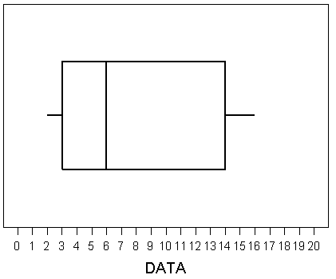

# Course Evaluations

## Reminder

The course evaluation for MATH 1051H is online on **Blackboard**. Please fill it in
today sometime if you haven't already. Your feedback is reviewed and valued.

Some things to keep in mind while responding:

* Workshops (TA:Student Ratio)
* Open Educational Resources
* Lots of turned in work (versus more tests)
* WeBWorK

# Final Exam Discussion, Review

## Final Exam

Our final exam will be held on December 17th at 7:00pm. Second last day. :(

There are three listed locations for the exam, but we will only be using two
of them: GYM (the gym in the Athletics Centre) and SC137 (the classroom
in the Science Complex). 

## Assignments to Rooms

* If your last name falls in A-D, you will be in SC 137
* If your last name falls in E-Z, you will be in GYM

**You must attend your assigned room, there will be NO
spare seating, and we will turn you away and make you walk across campus**

## Exam Format

* There are six long-answer problems that will be filled out - each one
you will be provided 1/2 page for the work.
* There are an additional 28 multiple-choice problems
* The examination is out of 50 points

## Coverage

* Coverage is the entire year
* About 70\% after the midterm, 30\% before
* Note that the material covered in Week 5 and 6 that wasn't on the midterm
counts as "after the midterm"
* Every question is taken from, or based on, the WeBWorK
* A review assignment (119 problems!) has been posted for you to practice with

# Review

## Summary of Problems

The following summarizes all of the kinds of problems that
are fair game for this exam.

## Kinds of Problems: Experimental Design, Sampling

* Populations versus samples
* Generalization of experiments and surveys
* Blocking variables
* Bias

## Distribution Problems

* Means
* Medians
* Skew
* Shapes
* Types of variables (numerical, discrete, etc.)

## Kinds of Problems: Probability

* Conditional probability (dogs and cats)
* Bayes Rule (drawing trees)
* Discrete Distributions (the 'Amazon books' problem)
* Binomial Distribution (pbinom, dbinom, qbinom)
* Continuous Distributions (normal: pnorm, qnorm)

## Kinds of Problems: Confidence Intervals and Hypothesis Tests

There are three main kinds of problems we've learned about, each with one or two sub-types. 

* Normal distribution, question about means: confidence intervals (Z) and hypothesis tests (Z)
  * Requires **either** known sigma and normality **or** normality and 30+ samples
* t distribution, question about means: confidence intervals (t) and hypothesis tests (t)
  * The rest of the cases: less than 30 samples **and** sigma not known
  * Technically not all the cases: you'll discuss this more if you take 1052H
* Normal distribution, question about proportions: confidence intervals (Z) and hypothesis tests (Z)

## Kinds of Problems: Confidence Intervals and Hypothesis Tests

You will need to be able to:

* Find CIs
* State and interpret hypotheses
* Find test statistics from sample statistics 
* Discuss assumptions of tests and CIs
* Find p-values
* Discuss Type 1 and Type 2 error

# Taking Up Some Problems

## Problem 1

A choral conductor has 1618 singers in her choir, some of them are professional singers. The conductor wants to estimate what percentage of singers are professional, but can't ask all 1618, so she instead asks 650 singers in front and finds 25 who are professionals.

* Identify the sample
* What specific type of bias does this scenario demonstrate?
* Identify the statistic
* Identify the population

## Problem 1

$\;$

## Problem 1

$\;$

## Problem 2

Identify: min, Q1, median, Q3, max

## Problem 2

$\;$

## Problem 3

A factory quality control manager decides to investigate the percentage of defective items produced each day. Within a given work week (Monday through Friday) the percentage of defective items produced was 2%, 1.4%, 4%, 3%, 2.2%.

* Find the mean
* Find the variance

## Problem 3

$\;$

## Problem 4

Using historical records, the personnel manager of a plant has determined the probability of X, the number of employees absent per day. It is

 X	    0	      1	      2	      3	      4	      5	      6	      7
----  ------  ------  ------  ------  ------  ------  ------  ------ 
P(X)	0.0048	0.0249	0.3099	0.3399	0.2192	0.0794	0.0184	0.0035

$\;$

* Find $P[2 \leq X \leq 5]$
* Find $P[X > 4]$

## Problem 4

$\;$

## Problem 5

Trees planted by a landscaping firm have a 90% one-year survival rate, If they plant 
15 trees in a park, what are the following probabilities:

* All the trees survive one year
* At least 13 trees survive one year

## Problem 5

$\;$

## Problem 5

$\;$

## Problem 6

In a certain community, 35% of the families own a dog, and 20% of the families that own a dog also own a cat. It is also known that 29% of all the families own a cat.

* What is the probability that a randomly selected family owns a dog? 
* What is the conditional probability that a randomly selected family owns a dog given that it owns a cat? 

## Problem 6

$\;$

## Problem 6

$\;$

## Problem 7

You ask a neighbor to water a sickly plant while you are on vacation. Without water 
the plant will die with probability 0.75. With water it will die with probability 0.45.
You are 90 % certain the neighbor will remember to water the plant.

You come back from the vacation and the plant is dead. What is the probability that the plant died because neighbor forgot to water it?

## Problem 7

$\;$

## Problem 7

$\;$

# More Review

## Normal (pnorm and qnorm)

We spent all of Lecture 15 on this topic: review the slides and video
from November 1st to review this topic.

## Hypothesis Tests and Confidence Intervals

We spent all of Lecture 22 on this topic: review the slides and video
from November 27th to review this topic.

# Thank You

## Thank You

It has been a pleasure teaching you all, and I wish you the best of 
luck on your examinations, and in your winter term. Don't be 
strangers!
